# AvaotaF1 启动

## 1. 串口调试
### 1.1 使用 USB 拆分器接入串口
#### 准备
- Avaota F1
- Type-C 数据线
- 全功能 Type-C 数据线
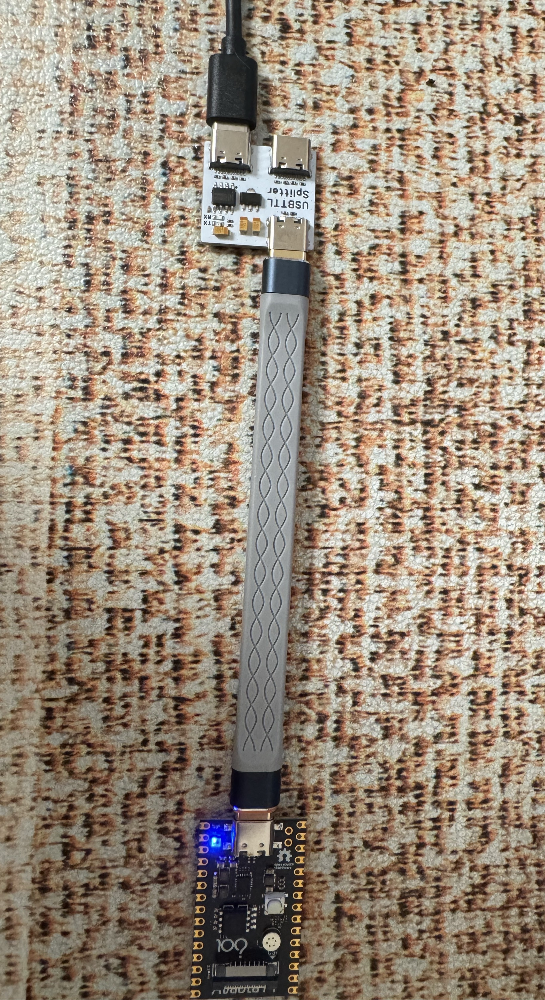
#### 确认端口号
硬件如图连接完成后，查看设备管理器，确认串口号，例如这里是COM5

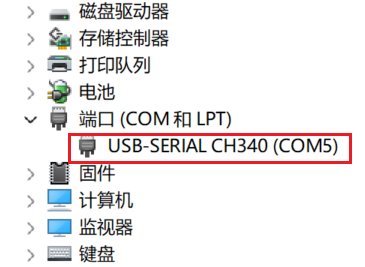
#### 登录终端
使用串口终端工具访问，波特率 115200。
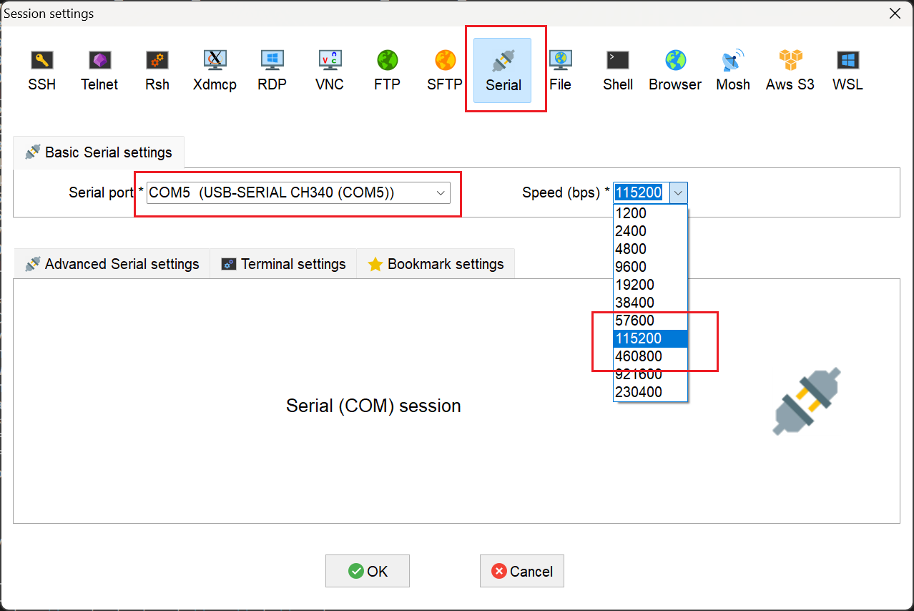
登录成功
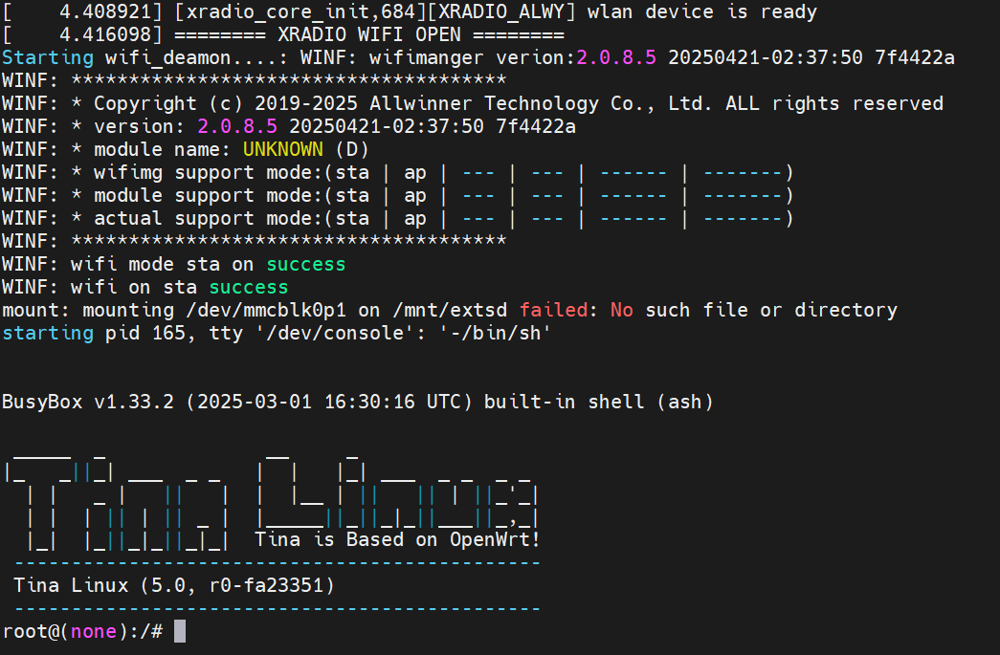
## 2. WiFi功能
### 2.1 连接WiFi

这里首先介绍如何使用 `wifi` 扫描网络：

#### 设置 `Wi-Fi` 为 `STATION` 模式

```
wifi -o sta 
```
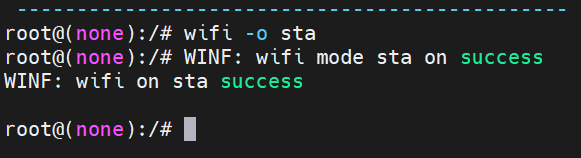
#### 扫描当前网络环境的 Wi-Fi 站点

```
wifi -s
```
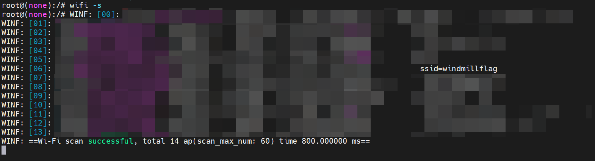
#### 连接Wi-Fi
（SSID windmillflag 密码 12345678）

注意：ssid不能有标点符号和空格，否则可能连接失败

```
wifi -c windmillflag 12345678
```
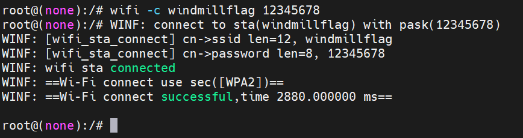
#### 连接网络后输入 `ifconfig` 即可查看当前 ip 地址
```
ifconfig
```
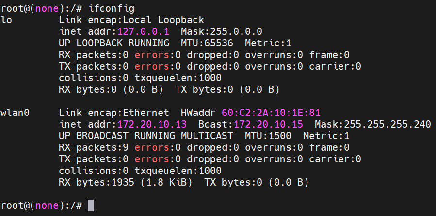

#### 可以使用 `ping` 命令测试 网络连接

```
ping www.baidu.com
```
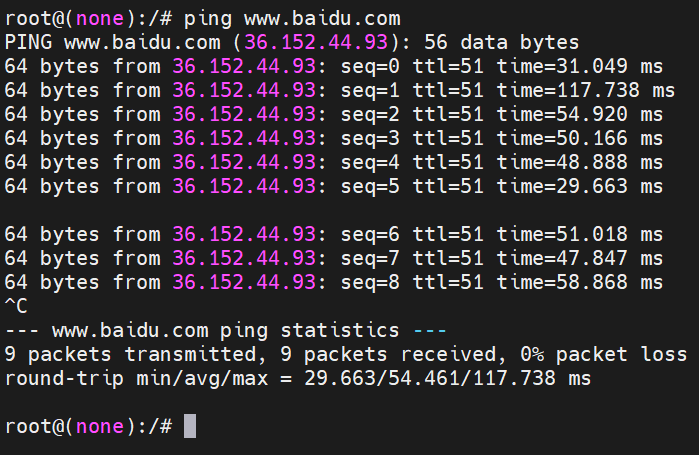

#### 断开Wi-Fi

```
wifi -d
```
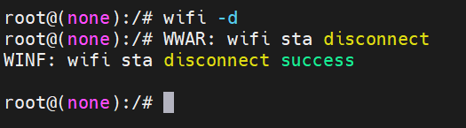

### 2.2 Wi-Fi 建立 AP

#### 创建热点 
（SSID：v821，密码 12345678）

```
wifi -o ap v821 12345678
```

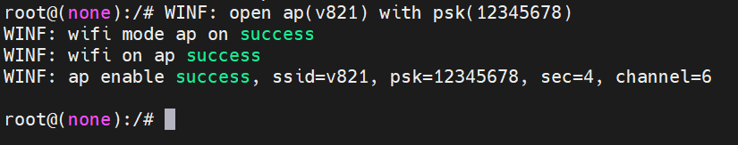

#### 连接WiFi
然后就可以扫描到 Wi-Fi 了，输入密码 12345678 进行连接
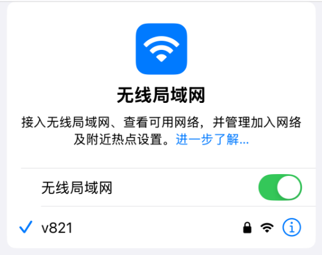