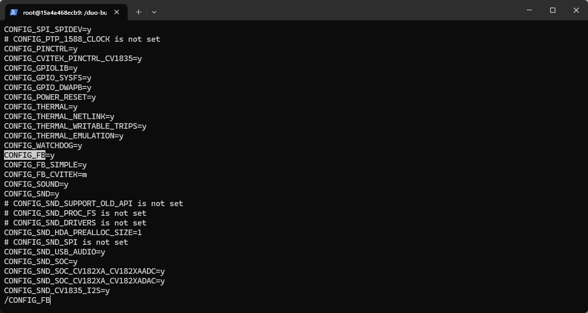
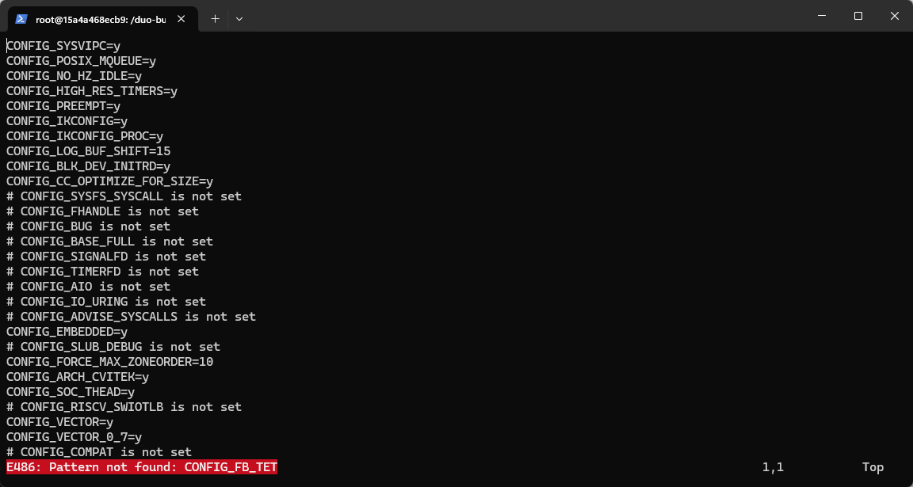
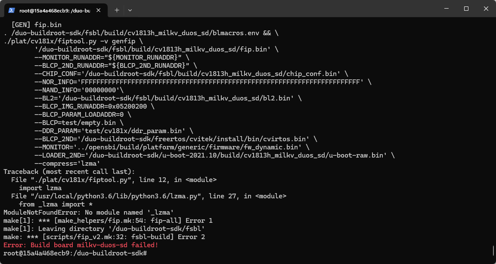
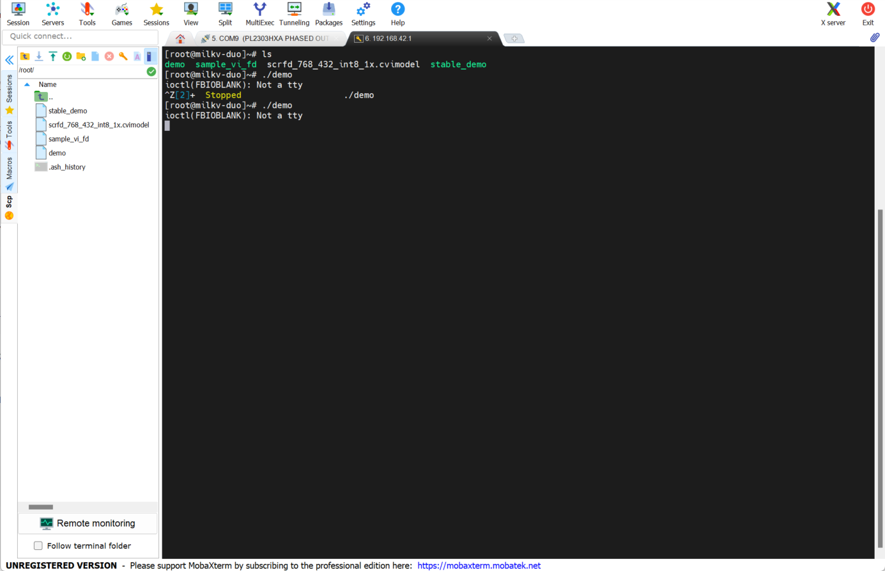
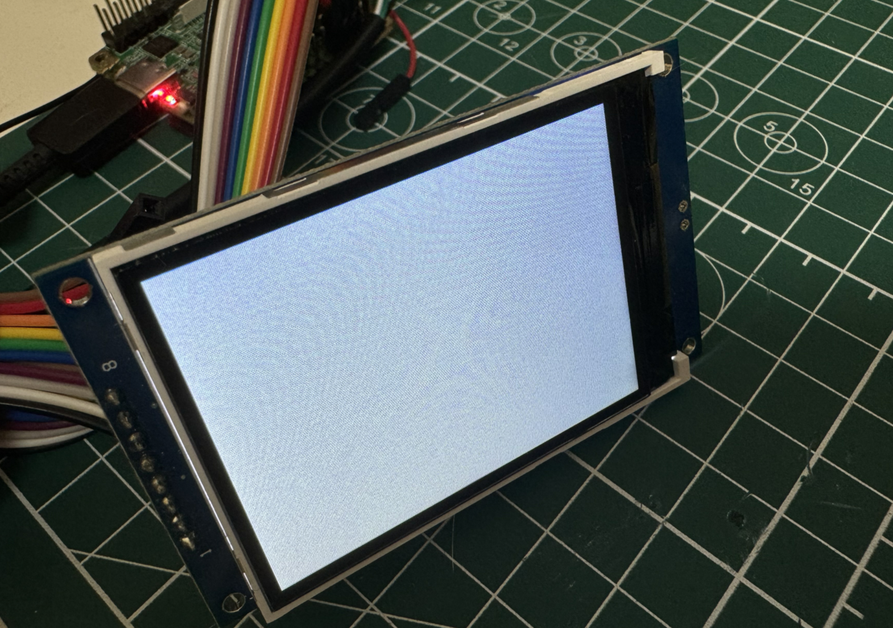

# 在Duo S 用 SPI 接口显示屏运行 LVGL 测试程序
## 点亮 SPI 显示屏[​](https://milkv.io/zh/docs/duo/resources/spilvgl#%E7%82%B9%E4%BA%AE-spi-%E6%98%BE%E7%A4%BA%E5%B1%8F "点亮 SPI 显示屏的直接链接")

### 编译固件[​](https://milkv.io/zh/docs/duo/resources/spilvgl#%E7%BC%96%E8%AF%91%E5%9B%BA%E4%BB%B6 "编译固件的直接链接")

获取官方SDK：[https://github.com/milkv-duo/duo-buildroot-sdk.git](https://github.com/milkv-duo/duo-buildroot-sdk.git)

```
git clone https://github.com/milkv-duo/duo-buildroot-sdk.git
```

获取 Duo LVGL Demo：[https://github.com/milkv-duo/duo-lvgl-fb-demo.git](https://github.com/milkv-duo/duo-lvgl-fb-demo.git)

```
git clone https://github.com/milkv-duo/duo-lvgl-fb-demo.git
```

进入 SDK 目录，并为 SDK 的内核打一个支持 ST7789V 芯片的补丁(该补丁在上面的 duo-lvgl-fb-demo.git 仓库中)：

```
cd duo-buildroot-sdkgit apply --reject ../duo-lvgl-fb-demo/duo-kernel-fb_st7789v.patch
```

确认内核配置有打开 FB TFT 的支持（最新的 Buildroot SDK 中默认都已经支持）：

```
CONFIG_FB=y
CONFIG_FB_TFT=y
CONFIG_FB_TFT_ST7789V=y
```

- DuoS SD：

```
build/boards/cv181x/cv1813h_milkv_duos_sd/linux/cvitek_cv1813h_milkv_duos_sd_defconfig
```

失败，找不到支持CONFIG_FB_TFT=y和CONFIG_FB_TFT_ST7789V=y


编译SD卡固件：

- DuoS SD：

```
./build.sh milkv-duos-sd
```
编译失败

## LVGL 测试

### 下载交叉编译工具链

下载工具链：

```
git clone https://github.com/milkv-duo/host-tools.git
```


进入到工具链目录中 `export` 工具链到环境变量中：

```
cd host-toolsexport PATH=$PATH:$(pwd)/gcc/riscv64-linux-musl-x86_64/bin
```

验证工具链是否可用：

```
riscv64-unknown-linux-musl-gcc -v
```

能够正常显示交叉编译工具链的版本信息，即工具链可用。

### 编译 LVGL

下载LVGL frame buffer demo 源码
```
git clone https://github.com/milkv-duo/duo-lvgl-fb-demo.git
```

进入 Demo 代码中的 lv_port_linux_frame_buffer 目录执行：

```
cd lv_port_linux_frame_buffer
make cleanmake -j
```

编译完成后，在 build/bin 目录会生成 demo 程序，通过 scp 命令拷贝到 Duo 设备上：

```
scp demo root@192.168.42.1:/root/
```

通过串口或者 SSH 登陆到 Duo 的终端控制台：

```
ssh root@192.168.42.1
```

为 demo 程序添加可执行权限：

```
chmod +x demo
```

运行测试程序：

```
./demo
```



运行失败，不显示
