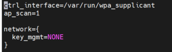
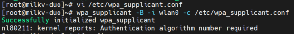
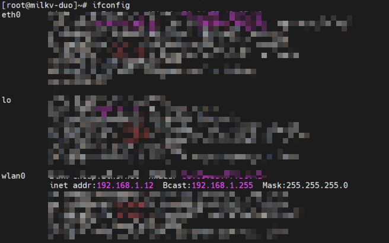
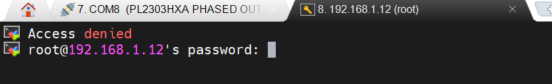
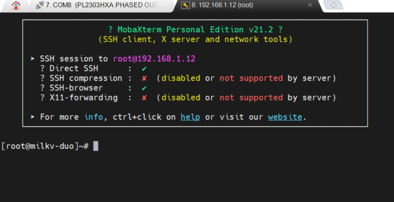

# DuoS WIFI 配置[​](https://milkv.io/zh/docs/duo/getting-started/duos#wifi-%E9%85%8D%E7%BD%AE "WIFI 配置的直接链接")

编辑如下文件，替换 `ssid` 和 `psk` 为要连接的 WIFI 账号和密码：

/etc/wpa_supplicant.conf
原内容




```
ctrl_interface=/var/run/wpa_supplicant
ap_scan=1
update_config=1

network={
  ssid="wifi_test"
  psk="12345678"
  key_mgmt=WPA-PSK
}
```

再执行如下命令：

```
wpa_supplicant -B -i wlan0 -c /etc/wpa_supplicant.conf
```





即可连接 WIFI，连接之后可以通过 `ifconfig` 或者 `ip a` 命令查看分配的 IP 地址。



尝试通过IP地址连接，密码milkv



成功登录

