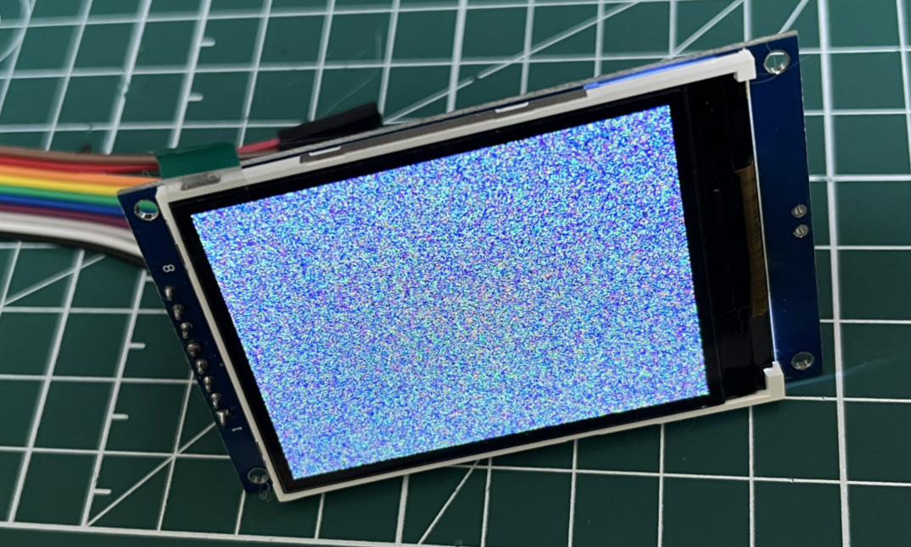

# 在Duo S运行故事机baby llama2
**让DuoS成为孩子的“故事王”**
通过外接SPI显示屏、麦克风、音频输出设备，Duo团队实现了一个简易的场景Demo。以下是我复现的步骤。

主要分为以下四个部分：

1、通过麦克风采集语音

2、经过语音转文字ASR模型实现语音实时转换

3、大模型实现“讲故事”实时交互

4、通过文字转语音TTS模型实现语音实时从扬声器播放“故事”
## 准备
- Duo s基础版/wifi版
- USB to TTL串口模块
- 网线（wifi版可以省略）
- Type-C线
- SPI显示屏
- USB声卡
- 麦克风
- 音响
- 按键
- 杜邦线（若干）
### 执行需要的文件：

| 文件名                    | 说明                    |
| ---------------------- | --------------------- |
| stable_demo            | 使用lvgl在lcd屏幕上实时显示内容   |
| runq-fast-gcc          | 模型网络结构主函数             |
| stories15M_q80.bin     | llama大模型的API权重信息      |
| tokenizer.bin          | llama大模型的API权重信息      |
| asr_chat-llama-baby.py | 通过语音转文字实现“讲故事”实时交互并播放 |

#### 编译stable_demo
```
#下载工具链，然后export环境变量：
cd host-tools
export PATH=$PATH:$(pwd)/gcc/riscv64-linux-musl-x86_64/bin
#下载lvgl项目 
git clone https://github.com/lvgl/lv_port_linux_frame_buffer.git
#然后进入lvgl项目 
cd lv_port_linux_frame_buffer/
编译
make clean && make install
```
#### asr_chat-llama-baby.py源码
```
# -*- coding: UTF-8 -*-
import http.client
import urllib.parse
import json
import subprocess
import time
import httpx
import requests

subprocess.Popen(['chmod', '+x', 'stable_demo'])
subprocess.Popen(['./stable_demo'])
print('Asr chat tts begin....')
appKey = 'P918jP30TLJNHi3Q'#'P918jP30TLJNHi3Q'#s9NZm8ozBKyX63vK'  #'RxkHgzYYYYLIP4OD'
token = '31b129713beb46b8b0db321a005ecb0d'

# Chat Configuration
API_KEY = "ebb785194c713e7b419ca8742277d414.hCBC11QCZvC5N0YK"
BASE_URL = "https://open.bigmodel.cn/api/paas/v4/chat/completions"
history = [{"role": "system", "content": "您好！"}]
# Aliyun
# url = 'https://nls-gateway-cn-shanghai.aliyuncs.com/stream/v1/asr'
host = 'nls-gateway-cn-shanghai.aliyuncs.com'

def record_on_gpio(pin):
    is_pressed = False
    audioFilepath = './output.wav'
    while True:
        try:
            with open('/sys/class/gpio/gpio{}/value'.format(pin), 'r') as gpio_file:
                value = gpio_file.read().strip()
            #print('get key value {}',value)
            if value == '1' and not is_pressed:
                # 按键按下时开始录音
                recording_process = subprocess.Popen(['arecord', '-f', 'dat', '-c', '1', '-r', '16000', 'output.wav'])
                is_pressed = True
                print("Recording started.")

            if value == '0' and is_pressed:
                subprocess.Popen(['killall', 'arecord'])
                recording_process.wait()  # 等待录音进程结束
                is_pressed = False
                print("Recording stopped.")
                return audioFilepath
        except Exception as e:
            print("Error:", e)

def process_chunk(chunk,response_accumulator):
    if chunk.strip() == "[DONE]":
        return True, None
    try:
        data = json.loads(chunk)
        # print('process_chunk data:', data)
        if 'choices' in data and data['choices']:
            for choice in data['choices']:
                if 'delta' in choice and 'content' in choice['delta'] and choice['delta']['content']:
                    result = choice['delta']['content']
                    # print('process_chunk result:', result)
                    response_accumulator.append(result)
                    return False, result
    except Exception as e:
        print(f"处理数据块时出错: {e}")
    return False, None


def chat(query, history):
    history += [{"role": "user", "content": query}]
    data = {
        "model": "glm-4",
        "messages": history,
        "temperature": 0.3,
        "stream": True,
    }

    headers = {
        "Authorization": f"Bearer {API_KEY}",
        "Content-Type": "application/json"
    }

    response_accumulator = []
    response = requests.post(BASE_URL, data=json.dumps(data), headers=headers, stream=True)
    send_to_lvgl(f"[CLEAR]{query}: ")
    try:
        for chunk in response.iter_lines():
            if chunk:
                chunk_str = chunk.decode("utf-8")
                if chunk_str.startswith("data: "):
                    chunk_str = chunk_str[len("data: "):]

                done, result = process_chunk(chunk_str,response_accumulator)
                # print('result is', result)

                chunk_str = "data: " + chunk_str
                # print("Get response:", chunk_str)
                if result:
                    send_to_lvgl(result)

        if done:
            tts_text = ''.join(response_accumulator)
            tts_to_play(tts_text)


    except Exception as e:
        print(f"Error: {str(e)}")


def send_to_lvgl(text):
    pipe_name = '/tmp/query_pipe'
    try:
        with open(pipe_name, 'w') as pipe:
            pipe.write(text)
            pipe.flush()
    except Exception as e:
        print(f"LVGL send error: {e}")


def process(request, token, audioFile) :
    # 读取音频
    print('process {} {}'.format(request, audioFile))
    with open(audioFile, mode = 'rb') as f:
        audioContent = f.read()

    host = 'nls-gateway-cn-shanghai.aliyuncs.com'

    # 设置HTTPS请求头部
    httpHeaders = {
        'X-NLS-Token': token,
        'Content-type': 'application/octet-stream',
        'Content-Length': len(audioContent)
        }

    conn = http.client.HTTPSConnection(host)

    conn.request(method='POST', url=request, body=audioContent, headers=httpHeaders)

    response = conn.getresponse()
    print('Response status and response reason:')
    print(response.status ,response.reason)

    try:
        body = json.loads(response.read())
        text = body['result']
        print('Recognized Text:', text)
        story = makeLLAMAStory(text)
        print('[makeLLAMAStory] return {}'.format(story))
        #send_to_lvgl(story)
        tts_to_play(story)
        #chat_response = chat(text, history)
        #print('Chat Response:', chat_response)
    except ValueError:
        print('The response is not json format string')

    conn.close()

def makeLLAMAStory(text):
    print('[makeLLAMAStory] {}'.format(text))
    recording_process = subprocess.Popen(['./runq-fast-gcc', 'stories15M_q80.bin', '-t', '0.8', '-n', '256', '-i', text], stdout=subprocess.PIPE, stderr=subprocess.PIPE)
    return_value, stderr = recording_process.communicate()
    return return_value.decode('utf-8')

def oneloop():
    print('Wait for key press')
    audioFilepath = record_on_gpio(499)

    #print('Wait for first audio')
    format = 'pcm'
    sampleRate = 16000
    enablePunctuationPrediction  = True
    enableInverseTextNormalization = True
    enableVoiceDetection  = False

# 设置RESTful请求参数
    asrurl = f'https://{host}/stream/v1/asr'
    request = asrurl + '?appkey=' + appKey
    request = request + '&format=' + format
    request = request + '&sample_rate=' + str(sampleRate)

    if enablePunctuationPrediction :
        request = request + '&enable_punctuation_prediction=' + 'true'

    if enableInverseTextNormalization :
        request = request + '&enable_inverse_text_normalization=' + 'true'

    if enableVoiceDetection :
        request = request + '&enable_voice_detection=' + 'true'

    print('Request: ' + request)

    process(request, token, audioFilepath)

def tts_to_play(text, file_path='response.wav'):
    ttsurl = f'https://{host}/stream/v1/tts'
    text_encoded = urllib.parse.quote_plus(text)
    tts_request = f"{ttsurl}?appkey={appKey}&token={token}&text={text_encoded}&format=wav&sample_rate=16000"

    conn = http.client.HTTPSConnection(host)
    conn.request('GET', tts_request)
    response = conn.getresponse()
    body = response.read()
    if response.status == 200 and response.getheader('Content-Type') == 'audio/mpeg':
        with open(file_path, 'wb') as f:
            f.write(body)
        print('TTS audio saved successfully')
        subprocess.Popen(['aplay', file_path])
    else:
        print('TTS request failed:', body)
    conn.close()


while True:
    try:
        oneloop()
    except Exception as e:
        print(e)
```

注意：源码中13-14行appKey和token，需更换自己的，地址：
[智能语音交互 (aliyun.com)](https://nls-portal.console.aliyun.com/overview?spm=5176.12061031.J_5253785160.4.54806822piszkb&accounttraceid=6e3c1aa3617f4ffd856c9e68addbcb6bvnna)
[智能语音交互控制台](https://nls-portal.console.aliyun.com/applist?spm=5176.11801677.help.31.22fe7a33qfzKiH)

操作方法：

1. 登录并开通语音交互服务，获取token


2. 在智能语音交互控制台创建项目，获取appKeay

runq-fast-gcc、 stories15M_q80.bin、tokenizer.bin来自llama源码，懒人包：
[PLCT-Works/Milk-V/DuoS/llama at main · DuoQilai/PLCT-Works (github.com)](https://github.com/DuoQilai/PLCT-Works/tree/main/Milk-V/DuoS/llama)

至此，准备工作完成。
## 下载镜像和工具
- 从[官方镜像和SDK](https://milkv.io/docs/duo/resources/image-sdk)下载DuoS SD卡版本的系统镜像，如：[milkv-duos-sd-v1.1.1-2024-0528.img.zip](https://github.com/milkv-duo/duo-buildroot-sdk/releases/download/Duo-V1.1.1/milkv-duos-sd-v1.1.1-2024-0528.img.zip)
注意：需要下载0410之后版本的镜像，且0410后版本镜像关闭了RNDIS功能，改用串口连接。如果网络适配器搜不到不要着急。
- 下载镜像烧录工具 [balenaEtcher](https://etcher.balena.io/) 或 [Rufus](https://rufus.ie/en/)
烧录方法详见[从 microSD 卡启动 Duo | Milk-V (milkv.io)](https://milkv.io/zh/docs/duo/getting-started/boot)
## 串口连接
### 连线方法
将USB-TTL的引脚对应Duo S的引脚，对应关系如下：

| Milk-V Duo S | <-----> | USB-TTL 串口 |
| ------------ | ------- | ---------- |
| GND（pin 6）   | <-----> | GND（黑色）    |
| TX（pin 8）    | <-----> | RX（绿色）     |
| RX（pin 10）   | <-----> | TX（白色）     |

对应引脚如图


连接Type-C线到电脑


### 登录方法
SSH工具，例如：[MobaXterm](https://mobaxterm.mobatek.net/)
按照如下步骤设置：


登录成功如下图所示：


## SPI显示屏连接
将SPI显示屏背面的引脚对应的接口和duo s板卡的引脚对应
Duo S整体引脚图如下：

整体引脚对应连接图如下：

实际连接图片


```
#清屏
cat /dev/zero > /dev/fb0
#花屏
cat /dev/random > /dev/fb0
```
测试花屏显示

测试运行stable_demo

## USB声卡连接
将USB声卡插入USB接口

### 音频输入连接

连接红色麦克风口

```
# 录音命令(Ctrl+C结束录音)：
arecord -f dat -c 1 -r 16000 XXXX.wav
```

### 音频输出连接
连接绿色音频输出口


```
# 播放录音:
aplay XXXX.wav
```

## 按键连接
按键连接引脚如下：（只需要将引脚和duo s对应功能的引脚连接即可）

实际连线图如下，也是最终连线图，终于完成啦，最后插上网线就能用了

## 软件使用方法

1、安装运行依赖包
```
pip install requests -i https://pypi.tuna.tsinghua.edu.cn/simple some-package
```

2、运行故事机baby llama

```
python asr_chat-llama-baby.py
# 在输出Wait for key press后，通过按键输入语音（按住即开始语音输入，松开即结束语音输入）
```
### 运行示例


## 参考文档：
- [【内附教程】来养一只羊驼宝宝吧？！快来Duo S上跑你的第一个生成式AI (qq.com)](https://mp.weixin.qq.com/s/ap7vjHvGWfXjb3ZP8v0UEA)
- [从 microSD 卡启动 Duo | Milk-V (milkv.io)](https://milkv.io/zh/docs/duo/getting-started/boot)
- [Duo S | Milk-V (milkv.io)](https://milkv.io/zh/docs/duo/getting-started/duos)
- [LlamaFamily/Llama-Chinese: Llama中文社区(github.com)](https://github.com/LlamaFamily/Llama-Chinese)