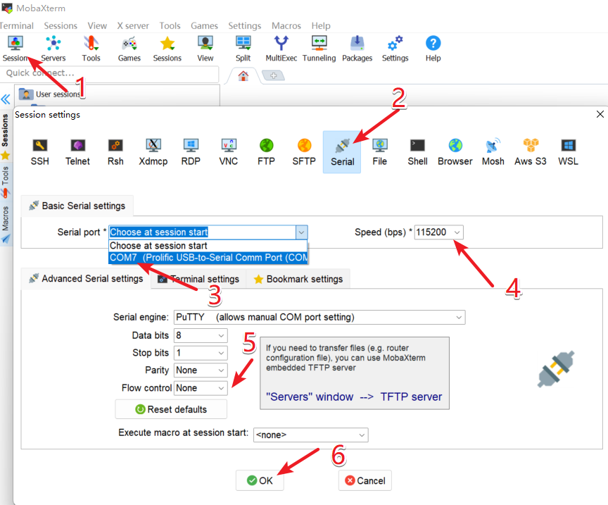

# 在Duo S运行故事机baby llama2
**让DuoS成为孩子的“故事王”**
通过外接SPI显示屏、麦克风、音频输出设备，Duo团队实现了一个简易的场景Demo。以下是我复现的步骤。
## 准备
- Duo s基础版/wifi版
- USB to TTL串口模块
- 网线（wifi版可以省略）
- Type-C线
- SPI显示屏
- USB声卡
- 麦克风
- 音响
- 按键
- 杜邦线（若干）
## 下载镜像和工具
- 从[官方镜像和SDK](https://milkv.io/docs/duo/resources/image-sdk)下载DuoS SD卡版本的系统镜像，如：[milkv-duos-sd-v1.1.1-2024-0528.img.zip](https://github.com/milkv-duo/duo-buildroot-sdk/releases/download/Duo-V1.1.1/milkv-duos-sd-v1.1.1-2024-0528.img.zip)
注意：需要下载0410之后版本的镜像，且0410后版本镜像关闭了RNDIS功能，改用串口连接。如果网络适配器搜不到不要着急。
- 下载镜像烧录工具 [balenaEtcher](https://etcher.balena.io/) 或 [Rufus](https://rufus.ie/en/)
烧录方法详见[从 microSD 卡启动 Duo | Milk-V (milkv.io)](https://milkv.io/zh/docs/duo/getting-started/boot)
## 串口连接
### 连线方法
将USB-TTL的引脚对应Duo S的引脚，对应关系如下：

| Milk-V Duo S | <-----> | USB-TTL 串口 |
| ------------ | ------- | ---------- |
| GND（pin 6）   | <-----> | GND（黑色）    |
| TX（pin 8）    | <-----> | RX（绿色）     |
| RX（pin 10）   | <-----> | TX（白色）     |
对应引脚如图

![[../../images/llama3.png]]
连接Type-C线到电脑

### 登录方法
SSH工具，例如：[MobaXterm](https://mobaxterm.mobatek.net/)

## 参考文档：
- [【内附教程】来养一只羊驼宝宝吧？！快来Duo S上跑你的第一个生成式AI (qq.com)](https://mp.weixin.qq.com/s/ap7vjHvGWfXjb3ZP8v0UEA)
- [从 microSD 卡启动 Duo | Milk-V (milkv.io)](https://milkv.io/zh/docs/duo/getting-started/boot)