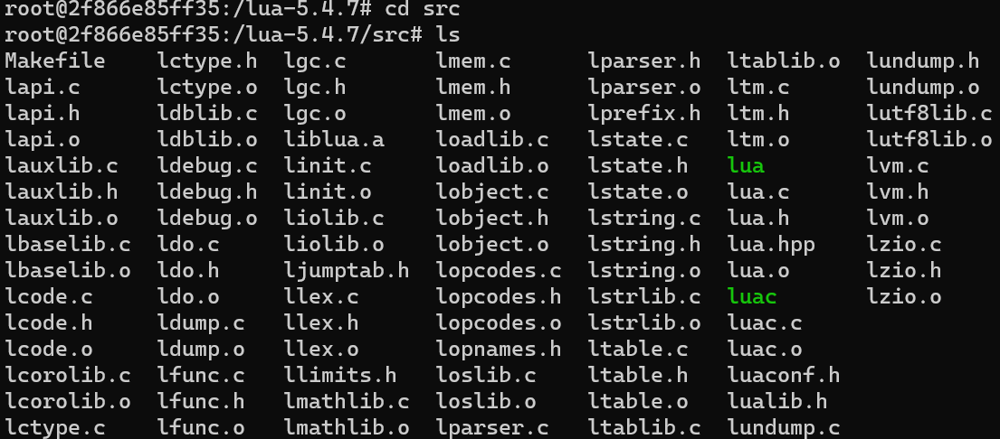
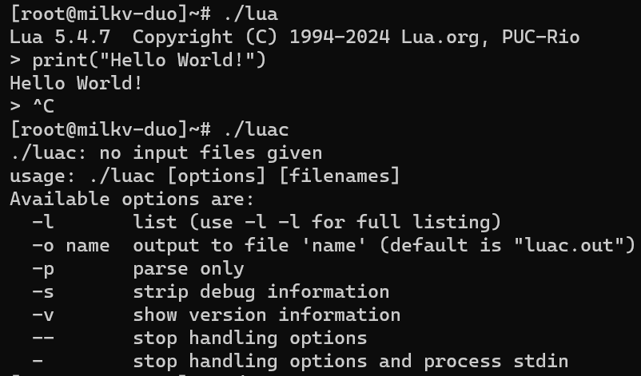
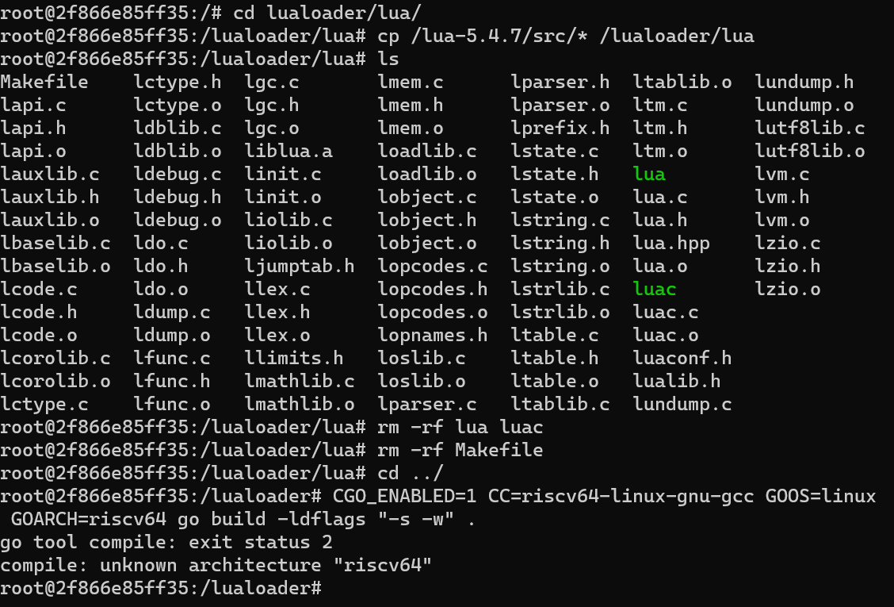

# 复现Debian12.6 交叉编译lua和lualoader(CGO项目)

## lua
下载 `gcc-riscv64-linux-gnu` 工具链

```
sudo apt install gcc-riscv64-linux-gnu
```

下载最新的lua源代码并解压。进入lua目录，编译
```
curl -L -R -O https://www.lua.org/ftp/lua-5.4.7.tar.gz
tar zxf lua-5.4.7.tar.gz
cd lua-5.4.7
make CC=riscv64-linux-gnu-gcc
```
此时 `src/` 目录下已经生成了 `lua` 和 `luac` 两个可执行文件

复制
scp lua luac root@192.168.42.1:/root
 cd /usr/riscv64-linux-gnu/lib/
scp ld-linux-riscv64-lp64d.so.1 libc.so.6 libm.so.6 root@192.168.42.1:/lib
scp libdl.so.2 root@192.168.42.1:
/lib

## lualoader

下载
```
git clone https://github.com/sapidexs/lualoader
```
cd lualoader/lua/
 cp /lua-5.4.7/src/* /lualoader/lua
  rm -rf lua luac
  cd ../
  