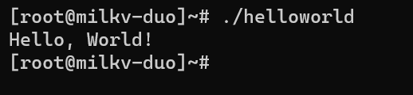

# wiringx

## 环境配置
安装编译依赖的工具
```
sudo apt-get install wget git make
```
获取 Examples 源码
```
git clone https://github.com/milkv-duo/duo-examples.git
```
加载编译环境
```
cd duo-examples
source envsetup.sh
```
编译测试

以`hello-world`为例，进入该例子目录执行`make`：
```
cd hello-world
make
```
复制到duo
```
scp helloworld root@192.168.42.1:/root/
```
执行程序
```
./helloworld
```
