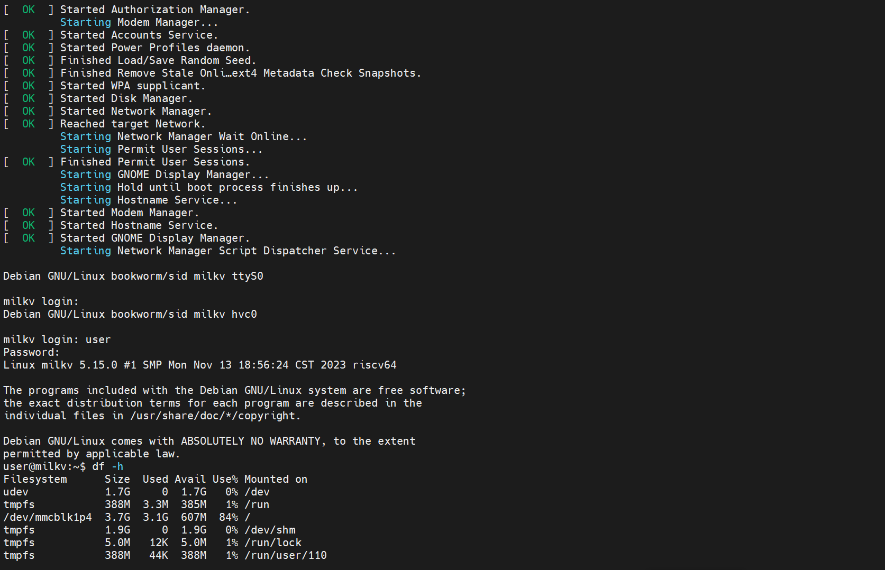

# Mars 启动

## 烧录镜像

1. 使用BalenaEtcher工具，烧录Mars镜像mars_debian-desktop_sdk-v3.6.1_sdcard_v1.0.6.img到sd卡

2. sd卡插入Mars
3. 使用适配器 (5V) 通过 Type-C 线连接 Mars，Mars 会自动上电开机，板上的红色电源灯会亮起。待系统启动成功后，板上的绿色状态灯会闪烁。

## 配置工作环境

1. 串口连接

|Milk-V Mars|<--->|USB 转 TTL 线|
|---|---|---|
|GND (pin 6)|<--->|黑线|
|TX (pin 8)|<--->|白线|
|RX (pin 10)|<--->|绿线|

2. 串口登录

3. 输入用户: user  密码: milkv

5.成功登录

