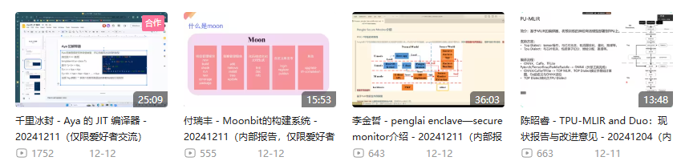
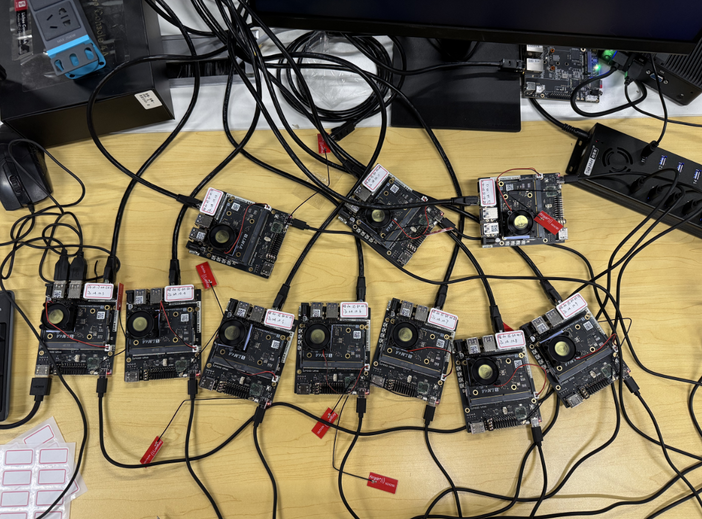

# Month9

本月工作

## 1. Milk-V Duo
### 视频AI配音

- [【Milk-V Duo】YOLOv8目标检测_哔哩哔哩_bilibili](https://www.bilibili.com/video/BV1AWqUYGEaS/?spm_id_from=333.999.0.0&vd_source=417238cd96b1b549d14bcb35a9da3cf0)

## 2.RISC-V short video项目
建议和修改同学们提交的视频，发布视频和控制进度

### 戊寅小队2025年计划

[PLCT-Works/RISC-V_short_video/Plan_Document/戊寅小队2025年计划.md at main · DuoQilai/PLCT-Works](https://github.com/DuoQilai/PLCT-Works/blob/main/RISC-V_short_video/Plan_Document/%E6%88%8A%E5%AF%85%E5%B0%8F%E9%98%9F2025%E5%B9%B4%E8%AE%A1%E5%88%92.md)

### 更新二进制翻译教学系列教学内容

[PLCT-Works/RISC-V_short_video/Project_proposal_box64.md at main · DuoQilai/PLCT-Works](https://github.com/DuoQilai/PLCT-Works/blob/main/RISC-V_short_video/Project_proposal_box64.md)
### LicheePi4A视频和操作文档汇总

[PLCT-Works/LicheePi4A/Summary_Document_LicheePi4A.md at main · DuoQilai/PLCT-Works](https://github.com/DuoQilai/PLCT-Works/blob/main/LicheePi4A/Summary_Document_LicheePi4A.md)
### 项目迭代计划：

https://github.com/DuoQilai/PLCT-Works/tree/main/RISC-V_short_video/Plan_Document

### 项目迭代回溯：

https://github.com/DuoQilai/PLCT-Works/tree/main/RISC-V_short_video/Review_Document

## 3.PLCT开放日演讲

- 北京出差
- PPT：[PLCT-Works/Notes/张馥媛-RISC-V 2024教学视频回顾.pptx at main · DuoQilai/PLCT-Works](https://github.com/DuoQilai/PLCT-Works/blob/main/Notes/%E5%BC%A0%E9%A6%A5%E5%AA%9B-RISC-V%202024%E6%95%99%E5%AD%A6%E8%A7%86%E9%A2%91%E5%9B%9E%E9%A1%BE.pptx)
## 4. 周三技术分享主持

## 5.南京RISC-V lab 
去南京英麒智能现场环境部署，皮套制作
### 在南京RISC-V lab上线了一台BPI-F3

和肥猫老师配合

### 在南京RISC-V lab上线了10台Licheepi4A

### 新闻稿编写

[RISC-V Lab（南京）试运营取得多项进展](https://mp.weixin.qq.com/s/GYI88Xx3yTg8L5kdxL8PAA)
### 皮套原画部分完成，动态制作中

[PLCT-Works/images/yingqi.cmo3 at main · DuoQilai/PLCT-Works](https://github.com/DuoQilai/PLCT-Works/blob/main/images/yingqi.cmo3)
