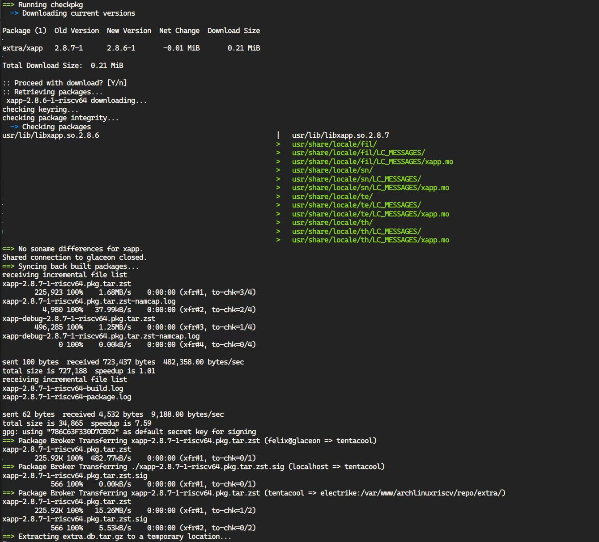

# Week 2

本周工作

## 在南京RVlab上线了一台BPI-F3

## 【Milk-V Duo 】YOLOv8目标检测视频教程AI配音

[【Milk-V Duo】YOLOv8目标检测_哔哩哔哩_bilibili](https://www.bilibili.com/video/BV1AWqUYGEaS/?spm_id_from=333.999.0.0&vd_source=417238cd96b1b549d14bcb35a9da3cf0)

## LicheePi4A视频和操作文档汇总

[PLCT-Works/LicheePi4A/Summary_Document_LicheePi4A.md at main · DuoQilai/PLCT-Works](https://github.com/DuoQilai/PLCT-Works/blob/main/LicheePi4A/Summary_Document_LicheePi4A.md)