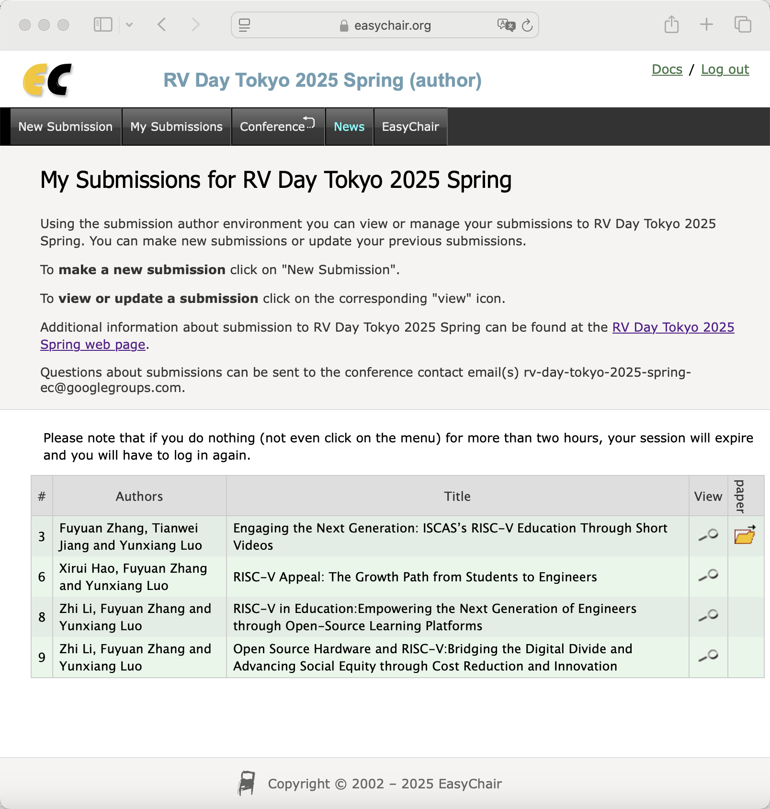
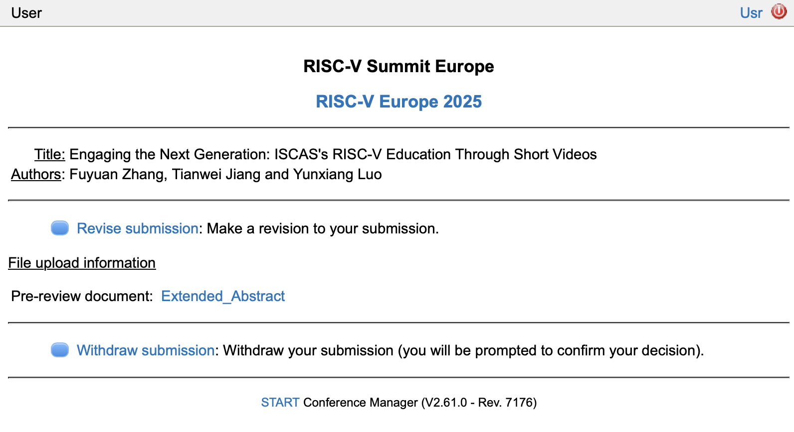

# Month10

本月工作

## 1. Milk-V Duo
## 确立Milk-V Duo YOLO实战课程模板和发布第一集
已下架整改

## 2.RISC-V short video项目
建议和修改同学们提交的视频，发布视频和控制进度

### 数据集调研报告

[PLCT-Works/RISC-V_short_video/Research_Document/Research_Datasets.md at main · DuoQilai/PLCT-Works · GitHub](https://github.com/DuoQilai/PLCT-Works/blob/main/RISC-V_short_video/Research_Document/Research_Datasets.md)
### 项目迭代计划：

https://github.com/DuoQilai/PLCT-Works/tree/main/RISC-V_short_video/Plan_Document

### 项目迭代回溯：

https://github.com/DuoQilai/PLCT-Works/tree/main/RISC-V_short_video/Review_Document

## 3.k230
k230启动
[PLCT-Works/k230/Report_k230_Setup.md at main · DuoQilai/PLCT-Works · GitHub](https://github.com/DuoQilai/PLCT-Works/blob/main/k230/Report_k230_Setup.md)

## 4.东京RV Day投稿

4篇摘要 1篇海报

## 5. 欧洲峰会投稿
1篇摘要

## 6.年度总结PPT

[PLCT-Works/Notes/张馥媛-年度总结.pptx at main · DuoQilai/PLCT-Works · GitHub](https://github.com/DuoQilai/PLCT-Works/blob/main/Notes/%E5%BC%A0%E9%A6%A5%E5%AA%9B-%E5%B9%B4%E5%BA%A6%E6%80%BB%E7%BB%93.pptx)

## 7.南京RISC-V lab 
去南京英麒智能现场环境部署，皮套制作
### 新闻稿编写

[RISC-V Lab（南京）试运营取得多项进展](https://mp.weixin.qq.com/s/GYI88Xx3yTg8L5kdxL8PAA)
### 参加南京RISC-V生态实验室及开源生态建设研讨会

[RISC-V生态实验室及开源生态建设研讨会于英麒智能成功举办](https://mp.weixin.qq.com/s/lOeF3Xiu1d3g5ofq05444Q)
### 皮套原画部分完成，动态制作中

[PLCT-Works/images/yingqi.cmo3 at main · DuoQilai/PLCT-Works](https://github.com/DuoQilai/PLCT-Works/blob/main/images/yingqi.cmo3)
