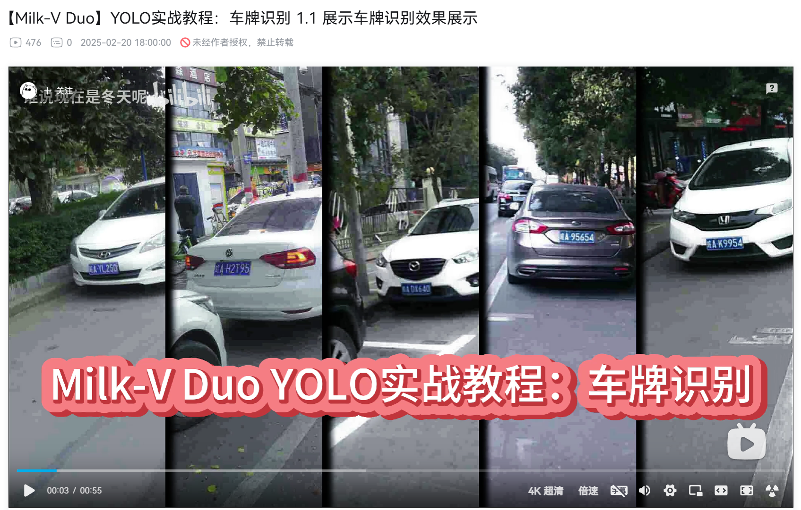

# Month11

本月工作

## 1. Milk-V Duo
## 确立Milk-V Duo YOLO实战课程模板和发布第一集
已整改

## 2.RISC-V short video项目
建议和修改同学们提交的视频，发布视频和控制进度

### 项目迭代计划：

https://github.com/DuoQilai/PLCT-Works/tree/main/RISC-V_short_video/Plan_Document

### 项目迭代回溯：

https://github.com/DuoQilai/PLCT-Works/tree/main/RISC-V_short_video/Review_Document

## 3.玄铁

### 玄铁课程制作

- 链接: https://pan.baidu.com/s/1phbeIX0bJtSIsQMEUAp0eQ?pwd=iuqp 提取码: iuqp 

### 玄铁大会演示

- 游戏演示
   - 链接: https://pan.baidu.com/s/1426mzoHKqsp8gJNi5pgfjA?pwd=518k 提取码: 518k
- k230演示
   - [K230 AI例程演示说明](https://github.com/DuoQilai/PLCT-Works/blob/main/Notes/XuanTie/K230AIDemoManualForDeployment.md)
## 4.东京RV Day参展

4篇摘要 2篇海报

## 5.南京RISC-V lab 

### 皮套完成

- [皮套完成](https://github.com/DuoQilai/PLCT-Works/blob/main/images/duoqilai.zip)