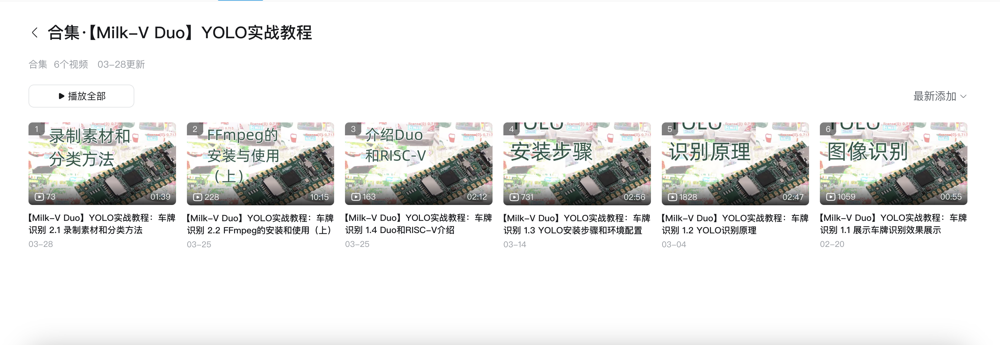
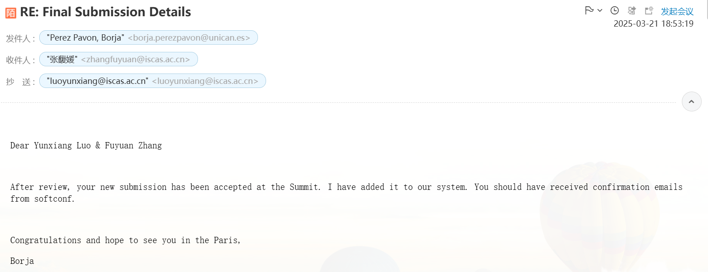
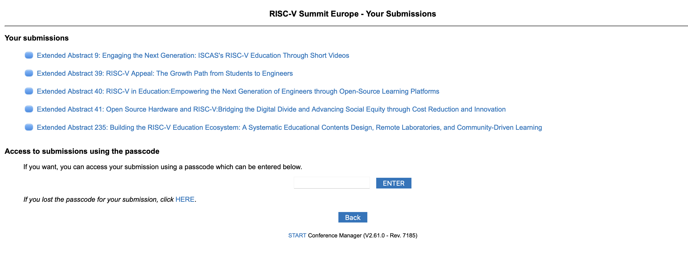

# Month12

本月工作

## 1. Milk-V Duo
## 发布Milk-V Duo YOLO实战课程更新到第6集
[项目方案](https://github.com/DuoQilai/PLCT-Works/blob/main/RISC-V_short_video/Project_proposal_yolo11_new.md)

- 1.1 展示车牌识别效果
- 1.2 介绍YOLO目标识别原理
- 1.3 YOLO环境准备
- 1.4 介绍Duo和RISC-V
- 2.1 录制素材和分类方法
- 2.2 FFmpeg的安装与使用

## 2.Licheepi 4A
视频AI配音
- [【Licheepi 4A】部署 mobilenetv2 模型完成图像分类的示例_哔哩哔哩_bilibili](https://www.bilibili.com/video/BV1JQ9EYbE8P/?spm_id_from=333.1387.homepage.video_card.click&vd_source=417238cd96b1b549d14bcb35a9da3cf0)
- [【LicheePi 4A】在 RISC-V上使用 Deepseek 运行 Llama.cpp_哔哩哔哩_bilibili](https://www.bilibili.com/video/BV1sz9EYqE9o/?spm_id_from=333.1387.homepage.video_card.click&vd_source=417238cd96b1b549d14bcb35a9da3cf0)
- [【Licheepi 4A】 TH1520 NPU 上运行 BERT 模型（HHB 量化 & 推理）_哔哩哔哩_bilibili](https://www.bilibili.com/video/BV1dVR3YNELY/?spm_id_from=333.1387.homepage.video_card.click&vd_source=417238cd96b1b549d14bcb35a9da3cf0)

## 3.RISC-V short video项目
建议和修改同学们提交的视频，发布视频和控制进度

### 新人指南：

https://github.com/DuoQilai/PLCT-Works/blob/main/RISC-V_short_video/baby_book.md

### 项目介绍：

https://github.com/DuoQilai/PLCT-Works/blob/main/RISC-V_short_video/Project_Introduction.md

### 项目迭代计划：

https://github.com/DuoQilai/PLCT-Works/tree/main/RISC-V_short_video/Plan_Document

### 项目迭代回溯：

https://github.com/DuoQilai/PLCT-Works/tree/main/RISC-V_short_video/Review_Document

## 4.欧洲峰会

提交扩展摘要并中稿

[PLCT-Works/Notes/Building the RISC-V Education Ecosystem A Systematic Educational Contents Design, Remote Laboratories, and Community-Driven Learning.pages at main · DuoQilai/PLCT-Works · GitHub](https://github.com/DuoQilai/PLCT-Works/blob/main/Notes/Building%20the%20RISC-V%20Education%20Ecosystem%20A%20Systematic%20Educational%20Contents%20Design%2C%20Remote%20Laboratories%2C%20and%20Community-Driven%20Learning.pages)

## 5.南京RISC-V lab 

1. 参加研讨会，分享国际化视角东京见闻 展示海报[新闻稿](https://mp.weixin.qq.com/s/tJQ32l2MA46Tf1QaK90qwg)
2. 部署新的7台licheepi4A到RVLab

