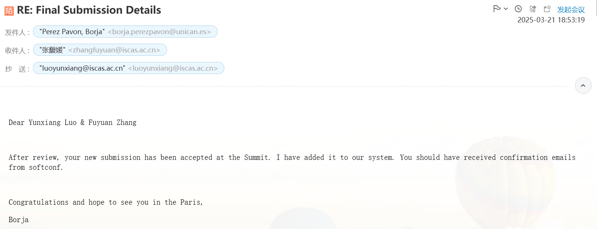

# Week 2

本周工作

## 欧洲峰会

提交扩展摘要并中稿

[PLCT-Works/Notes/Building the RISC-V Education Ecosystem A Systematic Educational Contents Design, Remote Laboratories, and Community-Driven Learning.pages at main · DuoQilai/PLCT-Works · GitHub](https://github.com/DuoQilai/PLCT-Works/blob/main/Notes/Building%20the%20RISC-V%20Education%20Ecosystem%20A%20Systematic%20Educational%20Contents%20Design%2C%20Remote%20Laboratories%2C%20and%20Community-Driven%20Learning.pages)

