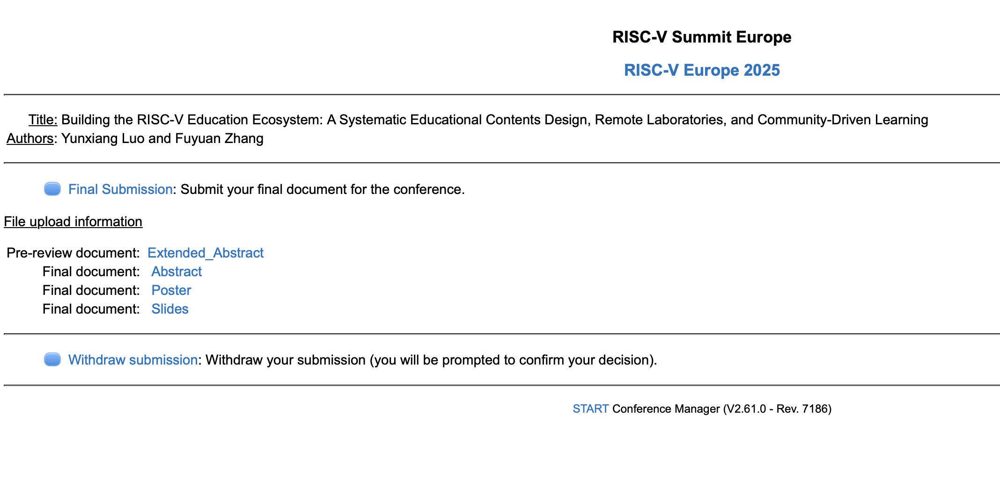

# Month13

本月工作

## 1. Milk-V Duo
### 发布Milk-V Duo YOLO实战课程更新到第10集
[项目方案](https://github.com/DuoQilai/PLCT-Works/blob/main/RISC-V_short_video/Project_proposal_yolo11_new.md)
- 2.3 FFmpeg的安装与使用(下)
- 2.3 X-AnyLabeling的安装与使用（上）
- 2.3 X-AnyLabeling的安装与使用（下）
- 3.1 设置模型参数

### 视频AI配音

- [【Milk-V Duo S】在 Duo S 上使用 Pico-8SEG-LED 数码管](https://www.bilibili.com/video/BV1jpLyzgE3T/?spm_id_from=333.1387.homepage.video_card.click&vd_source=417238cd96b1b549d14bcb35a9da3cf0)

## 2.RISC-V short video项目
建议和修改同学们提交的视频，发布视频和控制进度

### 项目迭代计划：

https://github.com/DuoQilai/PLCT-Works/tree/main/RISC-V_short_video/Plan_Document

### 项目迭代回溯：

https://github.com/DuoQilai/PLCT-Works/tree/main/RISC-V_short_video/Review_Document

## 3.欧洲峰会

提交扩展摘要、海报和演示文稿

[PLCT-Works/Notes/Building the RISC-V Education Ecosystem A Systematic Educational Contents Design, Remote Laboratories, and Community-Driven Learning.pages at main · DuoQilai/PLCT-Works · GitHub](https://github.com/DuoQilai/PLCT-Works/blob/main/Notes/Building%20the%20RISC-V%20Education%20Ecosystem%20A%20Systematic%20Educational%20Contents%20Design%2C%20Remote%20Laboratories%2C%20and%20Community-Driven%20Learning.pages)

