# RuyiSDK RISC-V 嵌入式开发课堂 ——DHT22+OLED 温湿度检测编程实验

# 1. 什么是嵌入式

嵌入式系统（Embedded System）是指嵌入到具体设备中的专用计算机系统，其主要功能通常围绕特定控制、数据处理或设备管理任务展开。

与传统个人计算机（PC）不同，嵌入式系统通常不会作为独立的通用计算平台使用，而是作为设备内部的一部分运行，用于完成特定功能。例如以下等任务，通常都由嵌入式系统完成：

- 传感器数据采集
- 电机控制
- 网络通信
- 图像处理
- 设备状态管理

一个典型的嵌入式系统通常由以下部分组成：

|组成部分|作用|
|---|---|
|处理器（CPU / MCU / SoC）|执行程序与控制系统运行|
|存储器（RAM / Flash）|保存程序与运行数据|
|输入输出接口（GPIO / UART / I2C）|与外部设备进行通信|
|软件或操作系统|实现系统功能与逻辑控制|

嵌入式系统广泛存在于现实生活中的各类电子设备中，例如：

- 家用电器
- 路由器
- 摄像头
- 智能穿戴设备
- 工业控制设备
- 汽车电子系统

虽然这些设备通常不具备传统 PC 的桌面交互界面，但其内部依然包含完整的计算机系统结构。

## 1.1 嵌入式系统与 PC 的区别

|类型|主要特点|
|---|---|
|PC|面向通用计算，强调性能与通用性|
|嵌入式系统|面向特定功能，强调稳定性与控制能力|

传统 PC 更强调：
- 通用计算能力
- 多任务处理
- 图形化交互

而嵌入式系统则更加关注：

- 特定功能实现
- 实时控制
- 长时间稳定运行
- 低功耗与小型化设计
## 1.2 嵌入式系统的发展路线

### 1.2.1 Bare Metal（裸机）

Bare Metal 指程序直接运行在硬件上，没有操作系统。

特点：

- 结构简单
- 资源占用低
- 实时性强

常见平台：

- 51 单片机
- STM32

### 1.2.2 RTOS（实时操作系统）

RTOS（Real-Time Operating System）是一种运行在 MCU 平台上的轻量级操作系统。

相比裸机RTOS 提供以下等能力：

- 多任务调度
- 定时器
- 任务优先级
- 实时响应

常见 RTOS：

- FreeRTOS
- RT-Thread
- Zephyr

RTOS 常用于：

- 工业控制
- IoT
- 机器人
- 实时任务系统

### 1.2.3 Embedded Linux

Embedded Linux 提供以下等功能：

- Shell
- 文件系统
- Driver
- 网络

常见平台：

- Duo S
- 树莓派

# 2. 嵌入式处理器的分类

## 2.1 MCU（Microcontroller Unit）

MCU（Microcontroller Unit，微控制器）是一种集成了处理器核、内存（通常是闪存和RAM）、输入/输出接口和时钟的单一芯片。MCU 通常用于：设备控制、传感器读取、电机控制、工业自动化等逻辑简单的特定场景。

常见 MCU 如下：

|MCU|特点|应用|
|---|---|---|
|51 单片机|结构简单|教学|
|STM32|性能较强|工业控制|
|ESP32|集成 Wi-Fi|IoT|

51单片机（8051单片机）中的“51”，来源于 Intel 于1980年推出的 MCS-51 微控制器系列。如今，“51单片机”通常泛指所有兼容 8051 指令集的单片机。


## 2.2 SoC（System on Chip）


SoC是一种将CPU、GPIO、USB、网络、多媒体模块等功能集成在单一芯片中的复杂处理平台。它的特点是能够运行 Linux 等复杂系统，适合高性能嵌入式设备。

常见 SoC 如下：

| SoC     | 平台           |
| ------- | ------------ |
| SG2000  | Duo S        |
| BCM2711 | Raspberry Pi |
| TH1520  | LicheePi 4A  |


## 2.3 DSP（Digital Signal Processor）

DSP是德克萨斯仪器公司专门设计用于处理数字信号的处理器。其机器指令对数字信号中的卷积、傅里叶变换、乘法、除法等运算非常快速。因其在数字信号处理方面的高效运算能力而得名。


## 2.4 FPGA（Field-Programmable Gate Array）

FPGA是一种可在实际使用前由用户编程的集成电路。利用可编程互连（verilog/VHDL）将可编程逻辑块（大量零散的与、或、非门电路块）按特定功能相连，形成复杂的组合逻辑或时序逻辑。


# 3. 什么是硬件、软件、固件


## 3.1 Hardware（硬件）

硬件（Hardware）是嵌入式系统中的物理组件，包括以下电子设备：

- 处理器（CPU / MCU / SoC）
- 存储器（RAM / Flash）
- 传感器（Sensor）
- 执行器（Motor / LED）
- 外设接口（GPIO / UART / I2C）

其中，处理器和存储器类似于人的“大脑”，负责运算、控制与数据存储；传感器类似于人的“感官”，用于获取外部环境信息；执行器则类似于人的“四肢”，负责执行系统动作。

硬件是嵌入式系统运行的基础。开发者需要根据系统需求选择合适的处理器、外围设备与电路设计方案。

## 3.2 Software（软件）

软件（Software）是运行在嵌入式系统上的程序与数据，包括以下内容：

- 应用程序
- Driver（驱动程序）
- 操作系统
- 算法与逻辑代码


软件负责实现系统功能与控制逻辑。例如以下操作：

- 读取传感器数据
- 控制 GPIO
- 网络通信
- 图像处理

在 Embedded Linux 系统中，软件通常运行在 Linux 操作系统之上，通过 Driver 与硬件进行交互。

## 3.3 Firmware（固件）

固件（Firmware）是一类介于硬件与软件之间的底层程序，通常存储在 Flash 等非易失性存储器中，用于初始化硬件并提供基础控制功能。

常见固件包括：

- Bootloader
- BIOS
- U-Boot
- MCU 固件程序

固件通常在系统上电后首先运行，负责：

- 初始化硬件
- 配置时钟
- 加载操作系统
- 启动应用程序

因此，固件可以看作连接硬件与软件之间的重要桥梁。

# 4.一个开发板内部到底有什么

开发板不仅仅是一块电路板，它实际上是一台完整的小型计算机。一个典型的嵌入式开发板通常包含：

- 处理器（CPU / MCU / SoC）
- 存储器（RAM / Flash）
- 时钟系统
- 输入输出接口（GPIO / UART / I2C）
- 定时器与中断系统
- 电源与外围电路

这些模块共同协作，完成嵌入式系统的运行与控制。

## 4.1 CPU 与存储


### 4.1.1 CPU（处理器）

CPU（Central Processing Unit）是嵌入式系统中的核心计算单元，负责以下等任务：

- 运算
- 数据处理
- 执行程序
- 控制外设

如果把嵌入式系统比作一个工厂，CPU 就像工厂中的“流水线与控制中心”，负责按照程序逻辑协调整个系统运行。

### 4.1.2 时钟（Clock）

CPU 的运行需要时钟信号提供统一节拍。时钟类似于工厂中的“生产节拍器”，所有模块都会按照统一节奏工作。

例如：

```
72MHz
```

表示系统每秒可以产生约 7200 万次时钟周期。通常情况下时钟频率越高，系统运行速度越快。

### 4.1.3 存储器（Memory）

嵌入式系统中的存储器主要包括：

|类型|特点|作用|
|---|---|---|
|ROM|只读|存储启动程序|
|RAM|速度快，断电丢失|临时运行数据|
|Flash|断电不丢失|存储程序与固件|


#### ROM（Read Only Memory）

ROM（只读存储器）通常用于存储以下等内容：

- Bootloader
- 启动代码
- 固定功能程序

ROM 中的数据通常在出厂时已经写入，不会频繁修改。

#### RAM（Random Access Memory）

RAM 用于临时存储：

- 变量
- 缓冲区
- 运行时数据

RAM 的读写速度较快，但断电后数据会丢失。它类似于工厂流水线旁边的“工作台”，用于临时放置正在处理的数据。

#### Flash

Flash 是一种非易失性存储器，用于保存：

- 程序代码
- 固件
- 配置文件

即使断电后数据也不会丢失。它类似于工厂中的“仓库”，用于长期存储系统运行所需的数据与程序。


#### 分级存储

CPU 的运行速度非常快，但大容量存储通常速度较慢。因此嵌入式系统会采用分级存储结构。

```
CPU↓RAM↓Flash
```

其中：

- RAM 更快
- Flash 容量更大

两者配合完成系统运行。

## 4.2 定时器、中断与看门狗

### 4.2.1 定时器（Timer）

定时器用于实现以下等功能：

- 定时任务
- 时间测量
- 周期控制

它类似于系统中的“计时器”或“闹钟”，能够在达到指定时间后触发任务。

例如以下等场景都需要使用定时器：

- 每隔 1 秒读取一次传感器
- 周期性刷新 OLED
- 产生 PWM 波形控制电机

### 4.2.2 中断（Interrupt）

中断是一种让 CPU 能够及时响应外部事件的机制。正常情况下，CPU 会按照程序顺序依次执行任务；而中断则类似于： “紧急通知”。当外部事件发生时，例如：

- 按键按下
- 串口收到数据
- 定时器到时

系统会暂时停止当前任务，优先处理该事件，处理完成后再返回原来的程序继续运行。中断能够提高系统的实时响应能力。

### 4.2.3 看门狗（Watchdog）

看门狗是一种用于提高系统稳定性的保护机制。它类似于系统中的“安全监控员”，持续监测程序是否正常运行。程序需要定期更新看门狗计数器，表示系统工作正常；如果程序进入死循环或长时间失去响应，看门狗会自动触发系统复位，使设备重新启动。

看门狗常用于以下等对稳定性要求较高的场景：

- 工业控制
- 长时间运行设备
- 无人值守系统

## 4.3 通用输入/输出(GPIO)

GPIO（General-purpose input/output），通用型输入输出。GPIO存在的意义就是用程序控制或读取他们的输出或输入。具体一个嵌入式处理器有多少组GPIO，可以去查看他们的对应的数据手册。
### 4.3.1 GPIO的工作模式
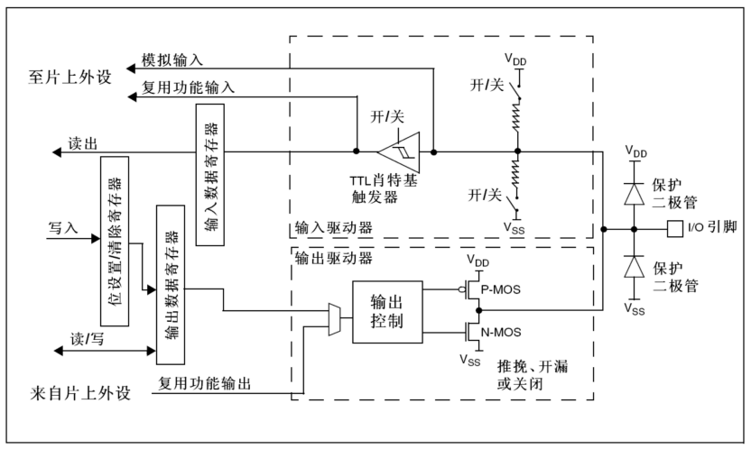
#### 输出模式

- 输出缓冲器被激活。
- 推挽模式：输出寄存器上的 1 将激活P-MOS，输出高电平。0 将激活N-MOS，输出低电平。
- 开漏模式：PMOS永远关闭。 输出寄存器上的 0 激活N-MOS，而输出寄存器上的1 将端口置于高阻状态，所以外部必须要接上拉电阻。
- 施密特触发输入被激活。
- 弱上拉和下拉电阻被禁止。
- 出现在I/O脚上的数据在每个APB2时钟被采样到输入数据寄存器。
- 在开漏模式时，对输入数据寄存器的读访问可得到I/O状态。
- 在推挽模式时，对输出数据寄存器的读访问得到最后一次写的值。

#### 复用输出模式

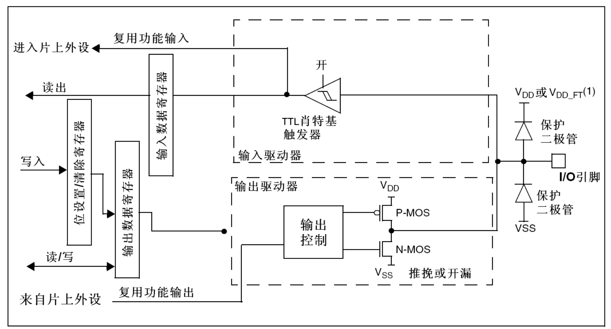
- 在开漏或推挽式配置中，输出缓冲器被打开。
- 内置外设的信号驱动输出缓冲器（复用功能输出）。
- 施密特触发输入被激活。
- 弱上拉和下拉电阻被禁止。
- 在每个APB2时钟周期，出现在I/O脚上的数据被采样到输入数据寄存器。
- 开漏模式时，读输入数据寄存器时可得到I/O口状态。
- 在推挽模式时，读输出数据寄存器时可得到最后一次写的值。

#### 输入模式

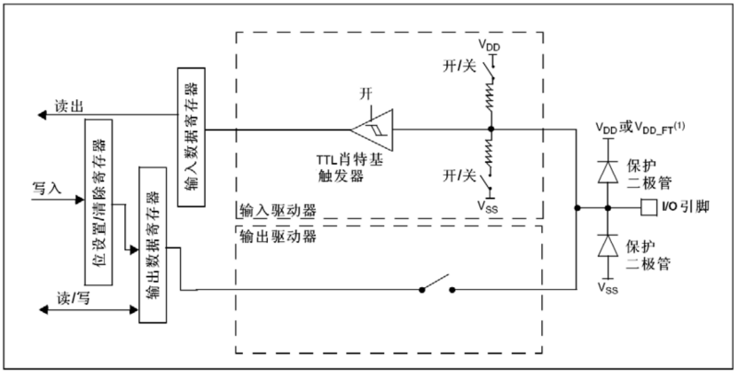

- 2个保护二极管的作用是保护我们的芯片不会由于电压过高或过低而烧毁。VDD接电源（3.3V），VSS接地（0V）。如果IO引脚的输入电压高于VDD的值到一定程度，上方保护二极管导通，则引脚电压被拉低到VDD。如果IO引脚的输入电压（负电压）低于VSS到一定程度，则下方保护二极管导通，电压被拉高到VSS。

- 2个开关控制引脚没有输入的时候是上拉、下拉或浮空。当上面的开关闭合的时候，输入被拉高到高电平。当下面的开关闭合的时候，输入被拉低到低电平。如果两个都不闭合，输入就是浮空状态。两个同时闭合，就是费电了，不会这么做的。
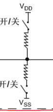
 

- 施密特（图中翻译成肖特基触发器应该是翻译错误，英文版手册是TTL Schmitt trigger）触发器是包含正反馈的比较器电路，可以对信号进行波形整形。

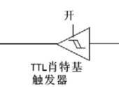 

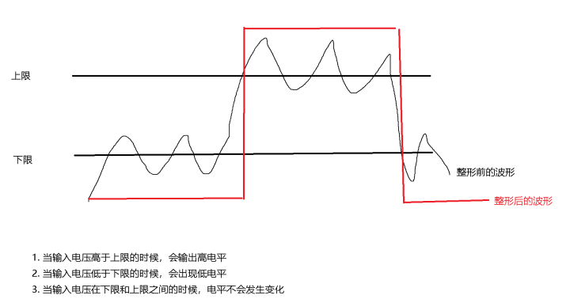 

- 从施密特触发器出来的数据，进入到输入数据寄存器中，我们就可以从中读取数据了。
#### 模拟输入模式
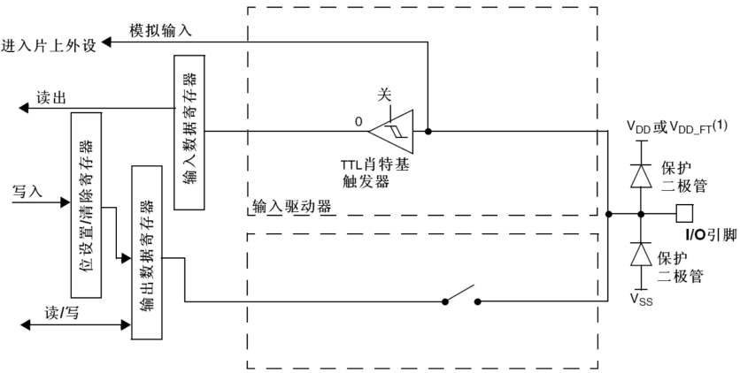
当配置为模拟输入时：
- 输出部分被禁止。
- 禁止施密特触发输入，实现了每个模拟I/O引脚上的零消耗。施密特触发输出值被强置为0。
- 弱上拉和下拉电阻被禁止。
- 读取输入数据寄存器时数值永远为0。
### 4.3.2 GPIO 使用示例案例

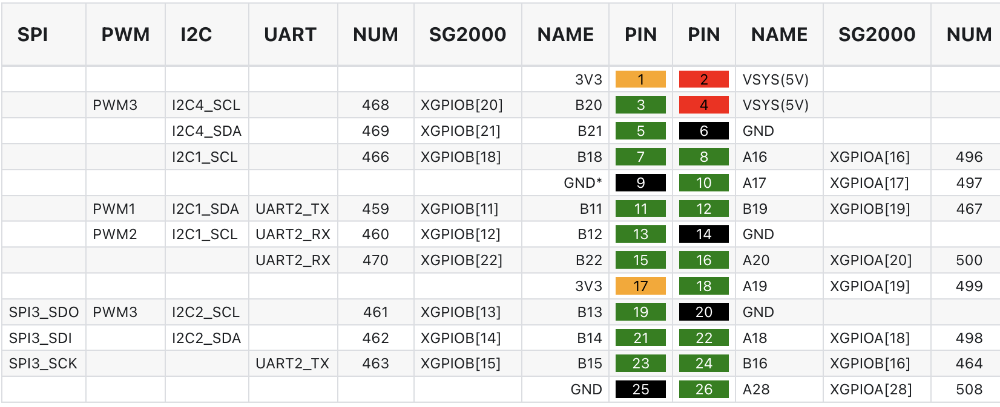

以 DuoS ，GPIO466 为例。

#### 执行以下操作配置 GPIO

```
$ cd /sys/class/gpio$ echo 466 > export
```

- 可以运行命令 ls /sys/class/gpio，列出 GPIO 目录，检查是否出现 gpio466，确认导出成功。

- 运行命令 `echo 466 > unexport`，可以取消 gpio466 引脚的导出。

#### 设置 GPIO 的方向

- 运行命令 `echo "out" > gpio466/direction`，将 gpio466 方向设置为输出。

- 运行命令 `echo "in" > gpio466/direction`，将 gpio466 方向设置为输入。

- 可以通过运行命令 `cat gpio466/direction` ，来查看设置的方向。

####  设置 GPIO 的电平

- 运行命令 `echo "1" > gpio466/value`，将 gpio466 的电平设置为高。

- 运行命令 `echo "0" > gpio466/value`，将 gpio466 的电平设置为低。

- 可以通过运行命令 `cat gpio466/value` ，来查看设置的电平。


## 4.4 脉冲宽度调制(PWM)
用于产生模拟信号，如控制电机速度、调光LED等，快速切换的高低电平（PWM）会被电机平均为对应占空比的比较平滑的模拟信号。在具有惯性的系统中，可以通过对一系列脉冲的宽度进行调制，来等效地获得所需要的模拟参量，常应用于电机控速等领域。
- PWM参数：
     频率 = 1 / TS            占空比 = TON / TS           分辨率 = 占空比变化步距

### 4.4.1 输出比较通道
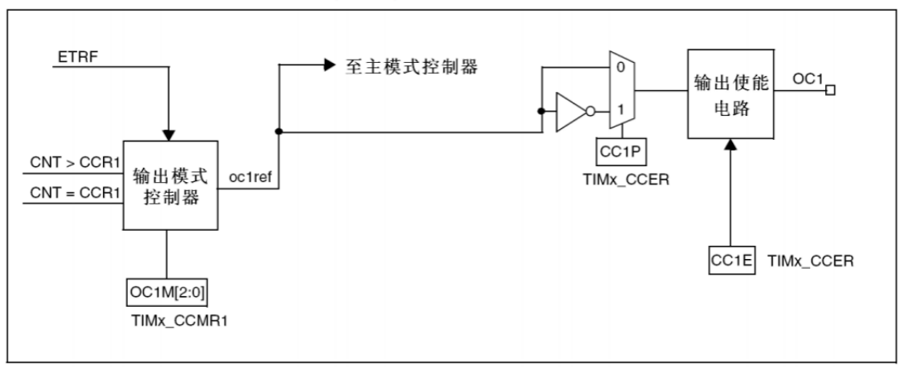
### 4.4.2 输出比较模式

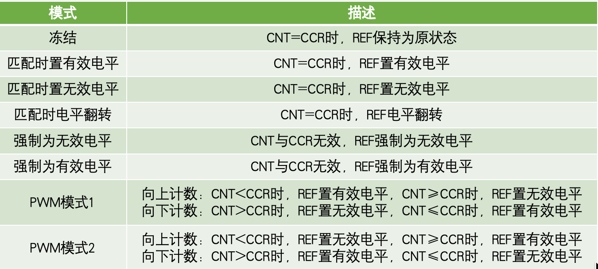

### 4.4.3 PWM基本结构
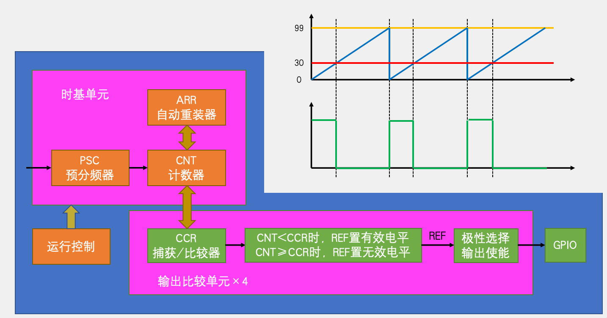

- PWM频率：	Freq = CK_PSC / (PSC + 1) / (ARR + 1)
- PWM占空比：	Duty = CCR / (ARR + 1)
- PWM分辨率：	Reso = 1 / (ARR + 1)

### 4.4.4 PWM 使用示例案例
以Licheepi 4A散热风扇所接的 PWM1 为例，可以通过如下代码获取风扇转速：

```bash
cat /sys/class/hwmon/hwmon0/pwm1
```

风扇的PWM转速值范围在0到255之间，值越大风扇转速越大。你可以向PWM使能写入`1`来启用手动调速，并设置转速（如255）：

```none
echo 0 > /sys/class/hwmon/hwmon0/pwm1_enable
echo 255 > /sys/class/hwmon/hwmon0/pwm1
```


使用以下命令可以恢复自动调速：

```bash
echo 2 > /sys/class/hwmon/hwmon0/pwm1_enable
```


或是完全禁用风扇：

```bash
echo 0 > /sys/class/hwmon/hwmon0/pwm1_enable
```


## 4.5 数字与模拟
### 4.5.1 模/数转换器(ADC)
ADC（Analog-Digital Converter，模拟-数字转换器）用于将连续变化的模拟电压转换为数字信号，从而实现对传感器等模拟设备的数据读取。ADC 建立了模拟电路与数字电路之间的桥梁，例如可将 0~3.3V 的输入电压转换为 0~4095 的数字结果。本项目使用 12 位逐次逼近型 ADC，单次转换时间约为 1μs，支持 18 个输入通道，可用于读取外部传感器或内部信号源，并具备规则组、注入组以及模拟看门狗等功能。
#### 为什么需要ADC

现实世界中的很多信号： 温度、光照、电压都是模拟信号。而 MCU / CPU只能处理数字数据。因此需要 ADC 将模拟电压转换为数字。

#### ADC 为什么能读取传感器

很多传感器本质上输出的是变化的电压：

|设备|电压变化原因|
|---|---|
|电位器|旋钮位置变化|
|光敏电阻|光照变化|
|温度传感器|温度变化|

#### ADC框图
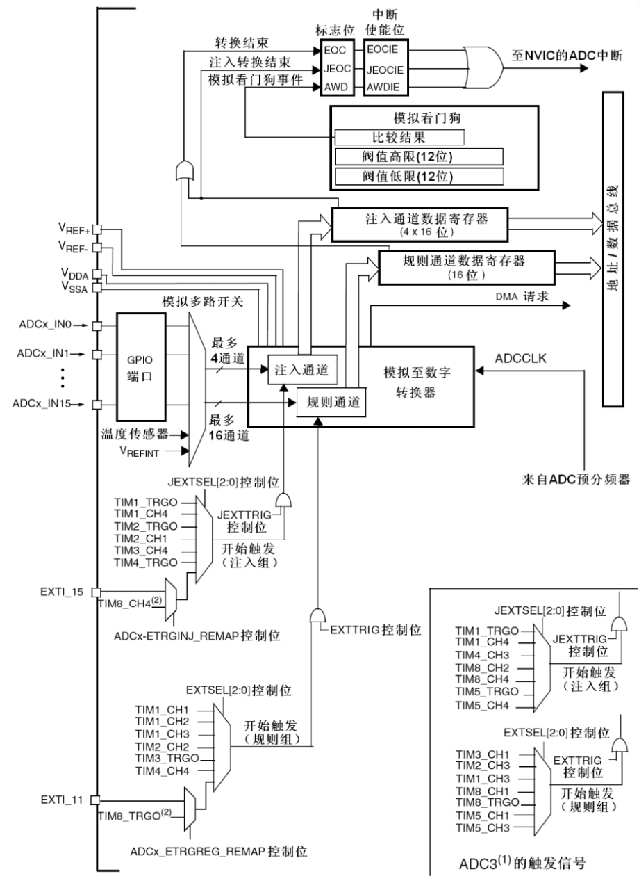
#### ADC 基本结构
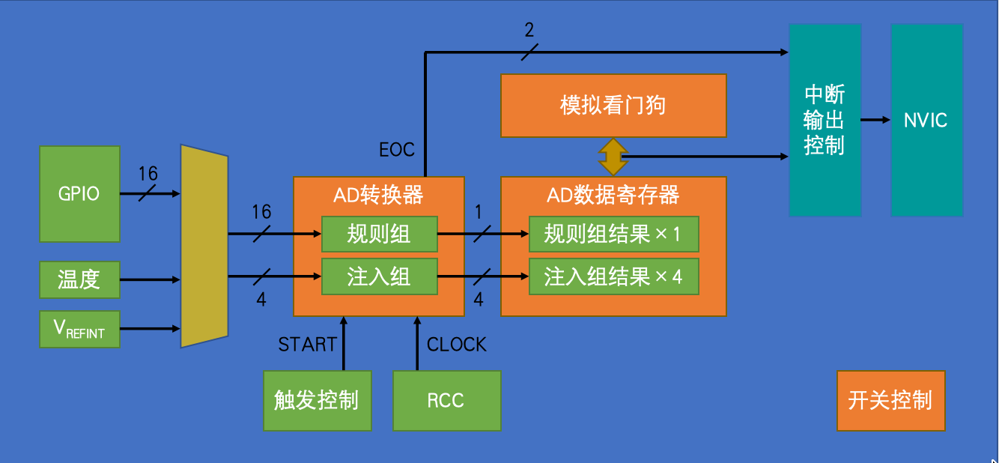
### 4.5.2 数/模转换器(DAC)
将数字信号转换为模拟信号，用于向执行器生成模拟输出。与 ADC 相反，DAC 完成的是“数字→模拟”的转换，常用于音频输出、电机控制、波形生成与电压控制等场景。例如，DAC 可以将内存中的数字数据转换为 0~3.3V 的模拟电压，用于控制外部设备。

|类型|作用|常见场景|
|---|---|---|
|ADC|模拟 → 数字|读取传感器|
|DAC|数字 → 模拟|音频、电机、电压输出|
### 4.5.3 ADC 使用示例案例

以Duo为例，硬件连接如下，将 Duo 的 GP26 连接到电位器信号脚，其他两脚分别连接电源正极和负极。
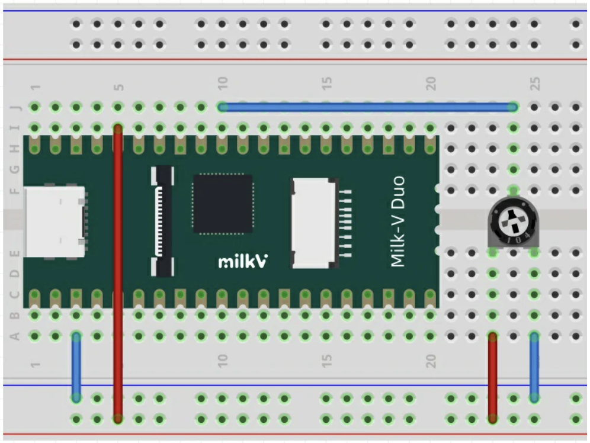

测试代码：

```
int adc_get_val = 0;

void setup() {
  pinMode(0,OUTPUT);
}

void loop() {
  adc_get_val = analogRead(31);

  digitalWrite(0,HIGH);
  delay(adc_get_val);
  digitalWrite(0,LOW);
  delay(adc_get_val);
}
```

能观察到板载 LED 灯闪烁频率随电位器位置改变而改变。


# 5. 嵌入式中的通信方式

## 5.1 UART

### 5.1.1串口介绍

串口通讯（Serial Communication）是一种设备间非常常用的串行通讯方式，因为它简单便捷，因此大部分电子设备都支持该通讯方式，电子工程师在调试设备时也经常使用该通讯方式输出调试信息。


  

### 5.1.2串口通讯协议

  


#### 波特率

“波特率”（Baudrate），它表示每秒钟传输了多少个码元。在二进制的世界，码元和位是等价的。用每秒传输的比特数表示波特率。常见的波特率有4800、9600、115200等。

#### 空闲位

串口协议规定，当总线处于空闲状态时信号线的状态为‘1’即高电平，表示当前线路上没有数据。

#### 通讯的起始位

每开始一次通信时发送方先发出一个逻辑“0”的信号（低电平），表示传输字符的开始。因为总线空闲时为高电平，所以开始一次通信时先发送一个明显区别于空闲状态的信号，即低电平。

#### 通讯的停止位

停止信号可由 0.5、1、1.5 或 2个逻辑1的数据位表示，只要双方约定一致即可。

#### 有效数据位

在数据包的起始位之后紧接着的就是要传输的主体数据内容，也称为有效数据，有效数据的长度常被约定为 5、6、7 或8位长，构成一个字符（一般都是8位）。先发送最低位，最后发送最高位，使用低电平表示‘0’、高电平表示‘1’，完成数据位的传输。

#### 校验位

数据位加上这一位后，使得“1”的位数应为偶数（偶校验）或奇数（奇校验），以此来校验数据传送的正确性。串口校验分几种方式：

- 无校验（no parity）。
- 奇校验（odd parity）：如果数据位中“1”的数目是偶数，则校验位为“1”，如果“1”的数目是奇数，校验位为“0”。
- 偶校验（even parity）：如果数据为中“1”的数目是偶数，则校验位为“0”，如果为奇数，校验位为 “1”。

  
  

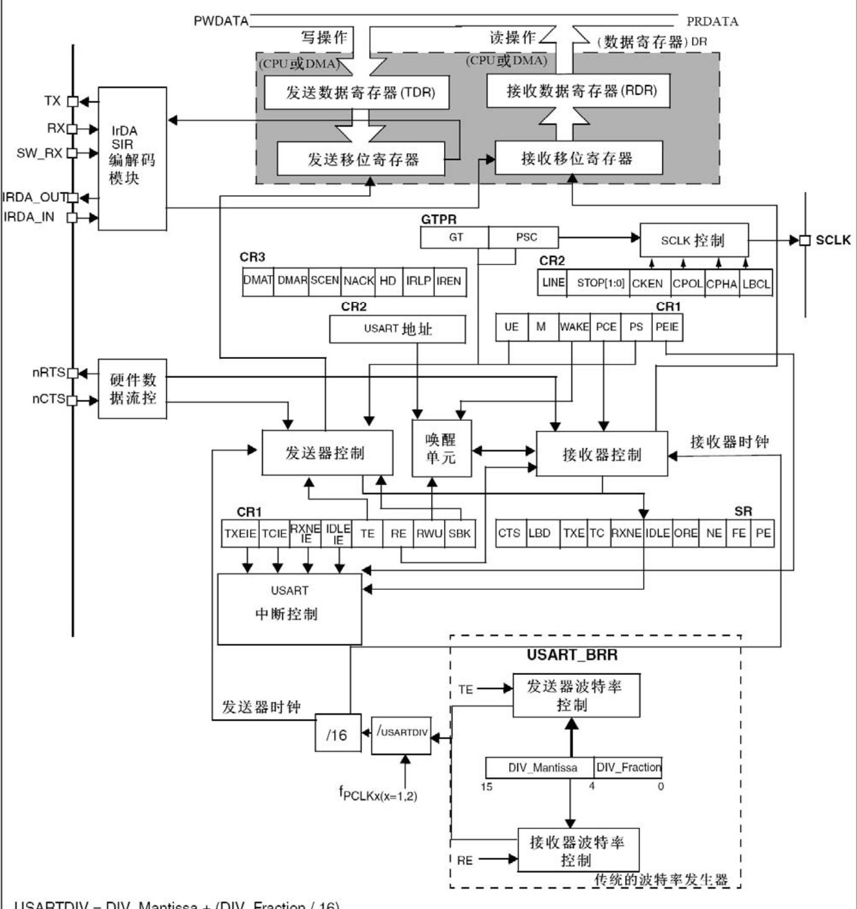

#### 功能引脚说明

  

- TX：发送数据输出引脚。
- RX：接收数据输入引脚。
- SW_RX：数据接收引脚，只用于单线和智能卡模式，属于内部引脚，没有具体外部引脚。
- nRTS：请求以发送（Request To Send），n 表示低电平有效。如果使能RTS流控制，当 USART接收器准备好接收新数据时就会将nRTS变成低电平；当接收寄存器已满时，nRTS 将被设置为高电平。该引脚只适用于硬件流控制。
- nCTS：清除以发送（Clear To Send），n 表示低电平有效。如果使能CTS流控制，发送器在发送下一帧数据之前会检测nCTS引脚，如果为低电平，表示可以发送数据，如果为高电平，则在发送完当前数据帧之后停止发送。该引脚只适用于硬件流控制。
- SCLK：发送器时钟输出引脚。这个引脚仅适用于同步模式。
#### 波特率的产生

发送器和接收器的波特率是一致的，都是通过设置BRR寄存器来得到。


这里的是给外设的时钟（usart1在APB2上一般是72MHz，usart2、3、4、5在APB1上一般为36MHz）。


假设我们需要的波特率是115200，则对应的分频值应该是：39.0625，把这个值写入到BRR寄存器中。39.0625的小数部分：0.0625 * 16 = 1, 整数部分是：39(0x27)。

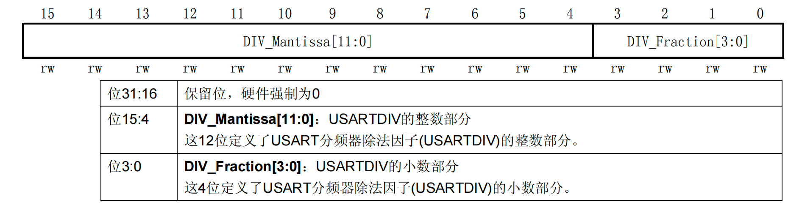

所以写入到BRR寄存器的值是：0x0271。

### 5.1.4 串口使用示例案例

#### 需求描述

以 STM32 为例，电脑通过串口向 STM32 发送数据，STM32 原封不动的再发送过来。电脑可以借助串口助手来发送或接收数据。

#### 硬件电路设计

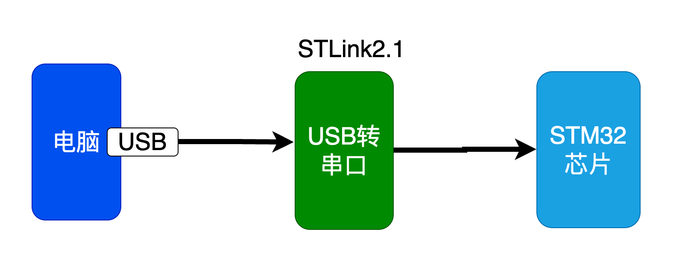


#### 软件设计：轮询的方式接收（寄存器）

##### main.c

```
#include "Driver_USART.h"
#include "Delay.h"
#include "string.h"

uint8_t buff[100] = {0};

uint8_t len = 0;

int main()

{

    Driver_USART1_Init();

    // Driver_USART1_SendChar('a');

    while (1)

    {

        // uint8_t *str = "Hello atguigu!\r\n";

        // Driver_USART1_SendString(str, strlen((char *)str));

        /* uint8_t *str = "测试\r\n";

        Driver_USART1_SendString(str, strlen((char *)str));

        Delay_s(1); */

        // uint8_t c =  Driver_USART1_ReceiveChar();

        // Driver_USART1_SendChar(c);

        Driver_USART1_ReceiveString(buff, &len);

        Driver_USART1_SendString(buff, len);

    }

}
```

##### Driver_USART.h
```
#ifndef __DRVIER_USART_H

#define __DRVIER_USART_H

#include "stm32f10x.h"

void Driver_USART1_Init(void);

void Driver_USART1_SendChar(uint8_t byte);

void Driver_USART1_SendString(uint8_t *str, uint16_t len);

uint8_t Driver_USART1_ReceiveChar(void);

void Driver_USART1_ReceiveString(uint8_t buff[], uint8_t *len);

#endif

```

  

## 5.2 I2C
### 5.2.1 基础知识

I2C 通讯协议（Inter-Integrated Circuit）是由Phiilps公司开发的，由于它引脚少，硬件实现简单，可扩展性强，不需要 USART、CAN等通讯协议的外部收发设备，现在被广泛地使用在系统内多个集成电路（IC）间的通讯。它是一种简单的双向两线制总线协议标准，支持同步串行半双工通讯。

### 5.2.1 硬件电路

I2C 通常由两根信号线组成：

|信号线|作用|
|---|---|
|SDA（Serial Data）|数据传输|
|SCL（Serial Clock）|时钟同步|

其中：

- SDA 用于发送与接收数据
- SCL 用于提供通信时钟

开发板通过这两根信号线即可完成与外部设备之间的通信。
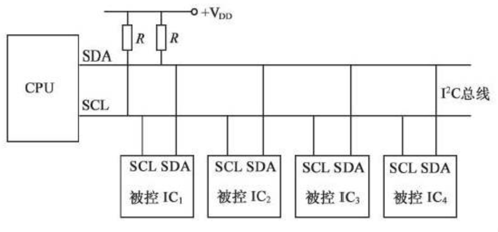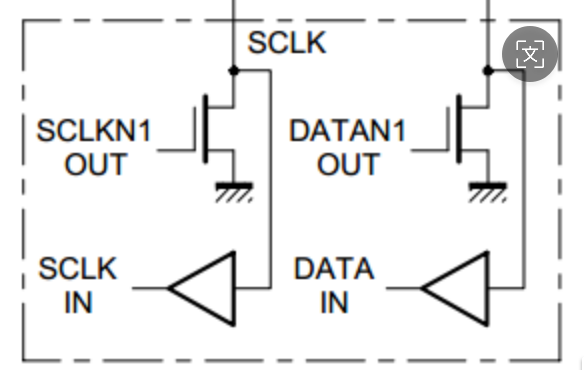

- 所有I2C设备的SCL连在一起，SDA连在一起
- 设备的SCL和SDA均要配置成开漏输出模式
- SCL和SDA各添加一个上拉电阻，阻值一般为4.7KΩ左右

### 5.2.3 时序
- 起始条件：SCL高电平期间，SDA从高电平切换到低电平
- 终止条件：SCL高电平期间，SDA从低电平切换到高电平
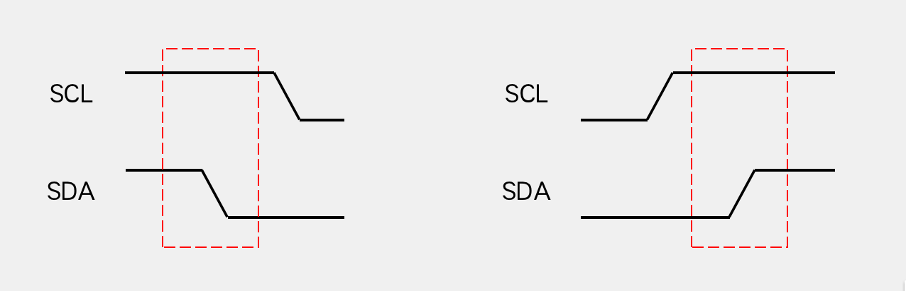
- 发送一个字节：SCL低电平期间，主机将数据位依次放到SDA线上（高位先行），然后释放SCL，从机将在SCL高电平期间读取数据位，所以SCL高电平期间SDA不允许有数据变化，依次循环上述过程8次，即可发送一个字节

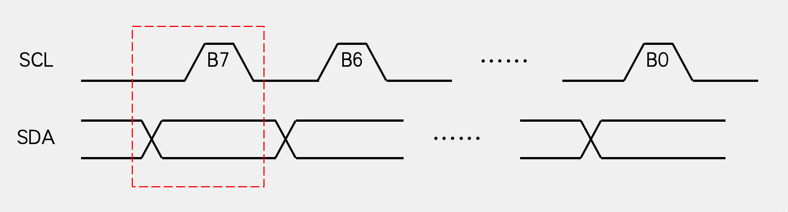
- 接收一个字节：SCL低电平期间，从机将数据位依次放到SDA线上（高位先行），然后释放SCL，主机将在SCL高电平期间读取数据位，所以SCL高电平期间SDA不允许有数据变化，依次循环上述过程8次，即可接收一个字节（主机在接收之前，需要释放SDA）

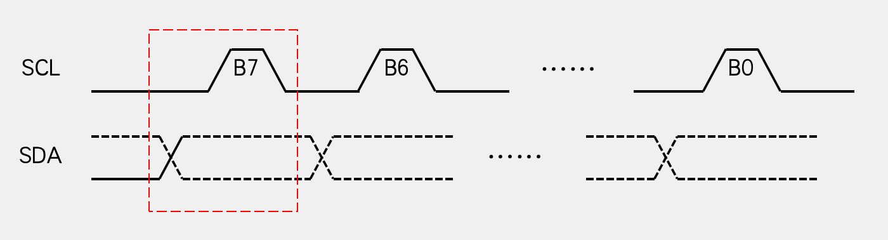
- 发送应答：主机在接收完一个字节之后，在下一个时钟发送一位数据，数据0表示应答，数据1表示非应答
- 接收应答：主机在发送完一个字节之后，在下一个时钟接收一位数据，判断从机是否应答，数据0表示应答，数据1表示非应答（主机在接收之前，需要释放SDA）

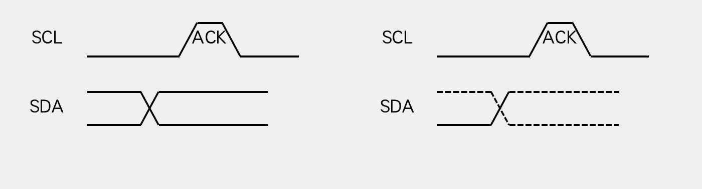
### 5.2.4 I2C 的设备地址

I2C 总线允许多个设备同时连接。为了区分不同设备，每个 I2C 外设通常具有唯一的设备地址。主设备在通信时，会通过地址选择目标设备。

例如：

```text
Milk-V Duo S
↓ I2C
OLED（0x3C）
```

表示开发板通过 I2C 总线与地址为 `0x3C` 的 OLED 模块通信。

### 5.2.5 I2C 的典型应用场景

|设备|作用|
|---|---|
|OLED|显示数据|
|传感器模块|采集环境数据|
|RTC 模块|时间记录|
|EEPROM|数据存储|

### 5.2.6 Linux 中的 I2C

在 Embedded Linux 系统中，I2C 设备通常以设备文件形式存在，例如：

```bash
/dev/i2c-0
/dev/i2c-1
```

开发者可以通过以下等工具检测与访问 I2C 设备：

- i2cdetect
- i2cget
- i2cset
## 5.3 SPI

- SPI（Serial Peripheral Interface）是由Motorola公司开发的一种通用数据总线
- 四根通信线：SCK（Serial Clock）、MOSI（Master Output Slave Input）、MISO（Master Input Slave Output）、SS（Slave Select）
- 同步，全双工
- 支持总线挂载多设备（一主多从）

### 5.3.1 硬件电路

- 所有SPI设备的SCK、MOSI、MISO分别连在一起

- 主机另外引出多条SS控制线，分别接到各从机的SS引脚

- 输出引脚配置为推挽输出，输入引脚配置为浮空或上拉输入
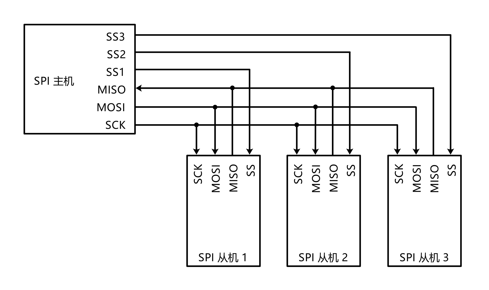

### 5.3.2 移位示意图
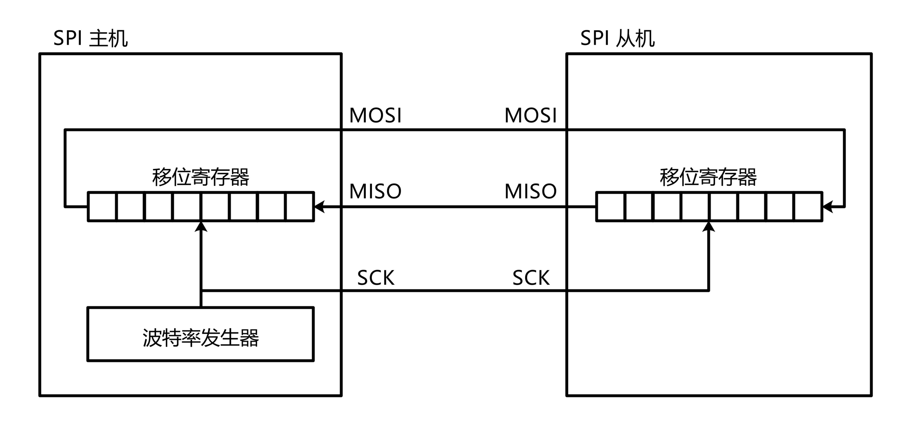

### 5.3.3 SPI 时序基本单元

- 起始条件：SS从高电平切换到低电平
- 终止条件：SS从低电平切换到高电平

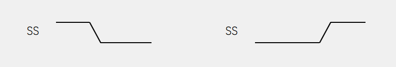

- 交换一个字节（模式0）
- CPOL=0：空闲状态时，SCK为低电平
- CPHA=0：SCK第一个边沿移入数据，第二个边沿移出数据
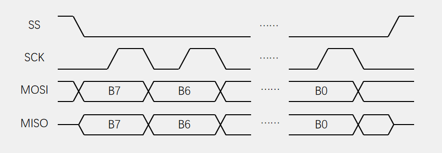

- 交换一个字节（模式1）
- CPOL=0：空闲状态时，SCK为低电平
- CPHA=1：SCK第一个边沿移出数据，第二个边沿移入数据
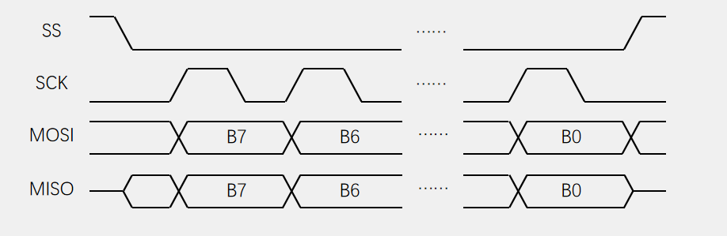

- 交换一个字节（模式2）
- CPOL=1：空闲状态时，SCK为高电平
- CPHA=0：SCK第一个边沿移入数据，第二个边沿移出数据
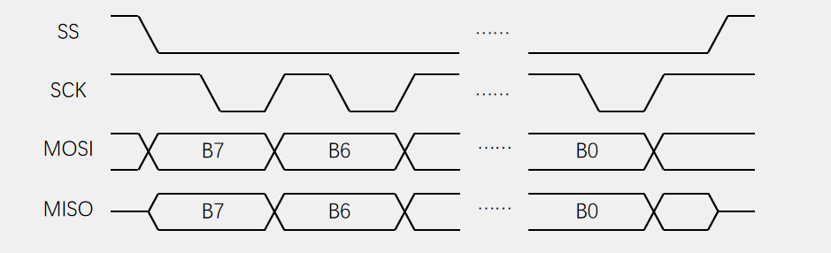

- 交换一个字节（模式3）
- CPOL=1：空闲状态时，SCK为高电平
- CPHA=1：SCK第一个边沿移出数据，第二个边沿移入数据
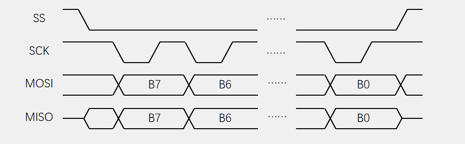

### 5.3.4 SPI时序
- 发送指令
- 向SS指定的设备，发送指令（0x06）
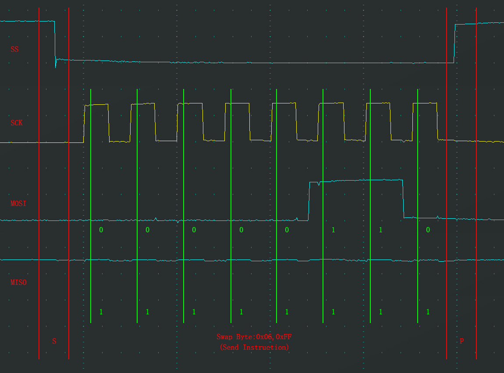

- 指定地址写
- 向SS指定的设备，发送写指令（0x02），随后在指定地址（Address[23:0]）下，写入指定数据（Data）
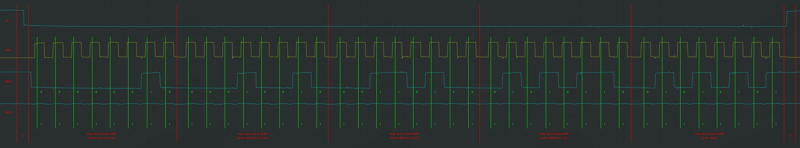

- 指定地址读
- 向SS指定的设备，发送读指令（0x03），随后在指定地址（Address[23:0]）下，读取从机数据（Data）
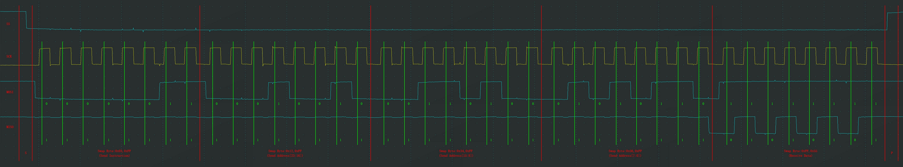

### 5.3.5 Flash 操作注意事项
- 写入操作时：
- 写入操作前，必须先进行写使能
- 每个数据位只能由1改写为0，不能由0改写为1
- 写入数据前必须先擦除，擦除后，所有数据位变为1
- 擦除必须按最小擦除单元进行
- 连续写入多字节时，最多写入一页的数据，超过页尾位置的数据，会回到页首覆盖写入
- 写入操作结束后，芯片进入忙状态，不响应新的读写操作
- 读取操作时：
- 直接调用读取时序，无需使能，无需额外操作，没有页的限制，读取操作结束后不会进入忙状态，但不能在忙状态时读取

### 5.3.6 SPI 基本结构
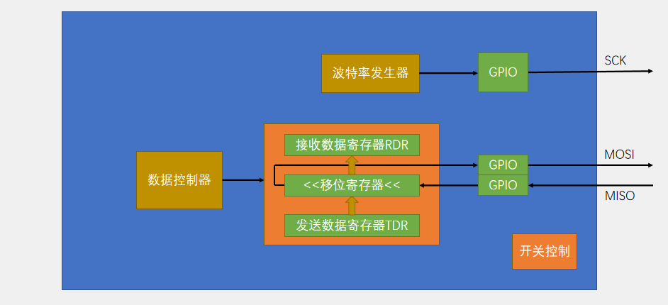

# 6. 交叉编译与 Toolchain

## 6.1 什么是交叉编译

交叉编译（Cross Compilation）指在一种平台上编译另一种平台运行的程序。例如：开发者通常在x86 PC（Windows / Linux）上进行开发，但程序实际运行在：ARM、RISC-V等嵌入式开发板上。因此：需要使用对应架构的交叉编译工具链。

| 架构     | 特点              | 常见设备                   |
| ------ | --------------- | ---------------------- |
| x86    | 性能强，常用于 PC 与服务器 | Windows PC / Linux 服务器 |
| ARM    | 功耗低，生态成熟        | STM32 / 树莓派 / 手机       |
| RISC-V | 开源指令集，灵活可扩展     | Duo S / RISC-V 开发板     |
### RISC-V

RISC-V 是第五代精简指令集，由加州伯克利分校所发起的一个开源项目，相比 CISC 而言更具精简性，指令执行效率更高。开源使其能够更加方便的运用在不同的领域，目前在 IoT、智能家居、芯片设计、操作系统、软件开发等领域都有应用。

本教程中的：Milk-V Duo S 就属于：RISC-V Embedded Linux 开发板。教程流程就是在 x86 电脑使用工具链编译 RISC-V 程序然后上传到开发板上运行。这种：“开发环境与运行环境不同”的开发方式，就是交叉编译。

```
x86电脑
↓
riscv64-linux-gnu-gcc
↓
RISC-V程序
↓
Milk-V Duo S运行

```


## 6.2 Toolchain 是什么

Toolchain（工具链）是一组用于编译、链接、生成程序的开发工具集合。常见 Toolchain 通常包括：

|组件|作用|
|---|---|
|GCC / LLVM|编译器|
|Binutils|汇编、链接工具|
|libc|C 标准库|

### GCC / LLVM

用于：

- 编译 C/C++ 程序
- 生成目标架构程序

例如：

```
riscv64-linux-gnu-gcc hello.c
```

### Binutils

Binutils 提供： ld（链接器）、 objdump、 readelf等底层工具。常用于：分析 ELF 文件、查看汇编、调试程序

### libc

libc 是 C 标准库，提供 printf、malloc、fopen等基础函数。常见 libc：

| libc   | 特点       |
| ------ | -------- |
| glibc  | Linux 常用 |
| musl   | 更轻量      |
| newlib | MCU 常用   |


## 6.3 RuyiSDK 简介

[RuyiSDK](https://ruyisdk.org/) 是一个由中国科学院软件研究所（ISCAS）主导的开源项目，该项目旨在为 RISC-V 开发者提供一个便捷、完善的开发环境。其提供了相关最新的硬件信息、软件支持，例如在支持的设备中有提供相关支持硬件情况；软件层面提供了镜像（如 [RevyOS](https://github.com/ruyisdk/revyos)）、工具链、包管理器等。

其最终目标是希望为 RISC-V 开发者提供一个完善、便捷的开发环境，使得 RISC-V 成为主流架构，以及建设并运营一个完善的社区以便开发者交流。最终希望 RuyiSDK 可以走向国际化，为全球的 RISC-V 开发者提供开发的便捷。

RuyiSDK 分为以下三个部分：

### Ruyi 包管理器

该包管理器是一个在线的软件源，在该包管理器中，提供了如下内容：

```text
1. 工具链
2. 调试工具
3. 模拟器
4. 运行环境
5. 文档
6. 源码
7. 工具、系统镜像
8. GUI（TODO）
```

### Ruyi IDE

该 IDE 是一个为 RISC-V 架构设计的开发工具箱，开发者可以轻松的通过 ruyi 包管理器获取，可以对于实际的开发场景对于代码的编写以及调试。 使用包管理器开发者可以获取该工具箱中的编译工具链、调试工具和模拟器，开发者可以使用模拟器或者在 RISC-V 开发板上对自身的程序进行编写以及调试。

### 社区

在我们的社区当中，提供了大量的相关技术文章、代码、教程视频，以及我们会举办一定的线下活动获得来自用户的反馈，在线上也会有相应的论坛提供给开发者进行技术交流。


RuyiSDK 对 RISC-V 设备的集成和支持主要包括以下几个方面：

- RISC-V 开发板镜像相关信息以及下载、安装教程，便于开发者获取相关镜像（换而言之提供一个镜像站），其中涵盖多种操作系统（如基于 Debian 的 RevyOS、openEuler RISC-V 等）提供给开发者使用。
- 提供 RISC-V 开发板对应的演示程序、开发资料和相关工具（含适用的编译工具链、模拟器等）的信息维护和下载，方便 RISC-V 开发者快速上手。
- 在集成开发环境中增加 RISC-V 设备专有向导页面、实现开发环境和运行环境的文件传输、支持在 RISC-V 设备上调试应用程序等。

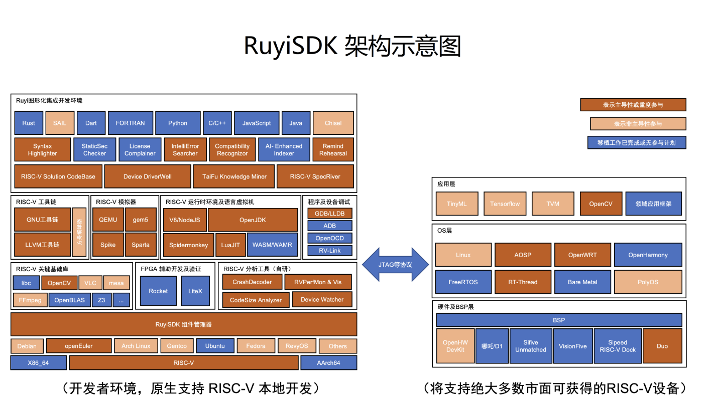

# 7. 示例项目：DHT22 温湿度监测系统

本项目介绍如何使用 RuyiSDK 在 Milk-V Duo S 开发板上快速部署编译环境，构建 DHT22 温湿度传感器测试程序，验证传感器数据读取功能，并且在OLED上显示。

## 7.1 部署开发环境

安装 ruyi 包管理器依赖包

```
sudo apt update; sudo apt install -y wget tar zstd xz-utils git build-essential
```

安装 ruyi 包管理器

```
wget https://mirror.iscas.ac.cn/ruyisdk/ruyi/tags/0.47.0/ruyi-0.47.0.riscv64
chmod +x ruyi-0.47.0.riscv64
sudo cp -v ruyi-0.47.0.riscv64 /usr/local/bin/ruyi
```

安装工具链

```
ruyi update
ruyi install gnu-plct llvm-plct
```

## 7.2 准备工作

* **开发板**：Milk-V Duo S (512M, SG2000)

* **传感器**：DHT22 温湿度传感器模块

* **其他**：microSD 卡、USB Type-C 数据线、OLED显示屏、杜邦线 7 根（母对母）

### 7.2.1 操作系统安装与启动验证

确保您的开发板已准备好系统。

参考文档：https://milkv.io/zh/docs/duo/getting-started/boot

### 7.2.2 硬件连接

| 连接名称 | VCC  | GND | SIGNAL |
| ---- | ---- | --- | ------ |
| 连接引脚 | 3.3V | GND | PIN23  |

| DHT22 | 信号     | Milk-V Duo S   |
| ----- | ------ | -------------- |
| VCC   | 3.3V供电 | J3头部 17脚（3.3V） |
| GND   | 地      | J3头部 14脚（GND）  |
| DATA  | 数据引脚   | J3头部 23脚       |

| OLED模块 | VCC  | GND | SCL  | SDA  |
| ------ | ---- | --- | ---- | ---- |
| 连接引脚   | 3.3V | GND | PIN3 | PIN5 |

| OLED模块 | 信号     | Milk-V Duo S  |
| ------ | ------ | ------------- |
| VCC    | 3.3V供电 | J3头部 1脚（3.3V） |
| GND    | 地      | J3头部 6脚（GND）  |
| SCL    | I2C时钟  | J3头部 3脚       |
| SDA    | I2C数据  | J3头部 5脚       |


## 7.3 编译应用与验证
#### 获取源码

```bash
ruyi extract milkv-duo-examples
mv milkv-duo-examples-* duo-examples
cd duo-examples
```

#### 修改源码

```bash
cd dht22
nano dht.c
```

将内容替换为：

```bash
#include <stdio.h>
#include <stdlib.h>
#include <stdint.h>
#include <unistd.h>
#include <string.h>
#include <time.h>
#include <fcntl.h>
#include <sys/ioctl.h>
#include <linux/i2c-dev.h>
#include <wiringx.h>

#define MAXTIMINGS 85
#define DHTTYPE 22

static int DHTPIN = 23;
static int dht22_dat[5] = {0, 0, 0, 0, 0};

// ========== OLED 配置 ==========
#define I2C_DEV "/dev/i2c-4"
#define OLED_ADDR 0x3C
static int i2c_fd = -1;

// 完整 8x8 点阵字库（ASCII 32-126）
static const uint8_t font8x8[95][8] = {
    {0x00,0x00,0x00,0x00,0x00,0x00,0x00,0x00}, // 32 空格
    {0x00,0x00,0x5F,0x00,0x00,0x00,0x00,0x00}, // 33 !
    {0x00,0x07,0x00,0x07,0x00,0x00,0x00,0x00}, // 34 "
    {0x14,0x7F,0x14,0x7F,0x14,0x00,0x00,0x00}, // 35 #
    {0x24,0x2A,0x7F,0x2A,0x12,0x00,0x00,0x00}, // 36 $
    {0x23,0x13,0x08,0x64,0x62,0x00,0x00,0x00}, // 37 %
    {0x36,0x49,0x55,0x22,0x50,0x00,0x00,0x00}, // 38 &
    {0x00,0x05,0x03,0x00,0x00,0x00,0x00,0x00}, // 39 '
    {0x00,0x1C,0x22,0x41,0x00,0x00,0x00,0x00}, // 40 (
    {0x00,0x41,0x22,0x1C,0x00,0x00,0x00,0x00}, // 41 )
    {0x14,0x08,0x3E,0x08,0x14,0x00,0x00,0x00}, // 42 *
    {0x08,0x08,0x3E,0x08,0x08,0x00,0x00,0x00}, // 43 +
    {0x00,0x50,0x30,0x00,0x00,0x00,0x00,0x00}, // 44 ,
    {0x08,0x08,0x08,0x08,0x08,0x00,0x00,0x00}, // 45 -
    {0x00,0x60,0x60,0x00,0x00,0x00,0x00,0x00}, // 46 .
    {0x20,0x10,0x08,0x04,0x02,0x00,0x00,0x00}, // 47 /
    {0x3E,0x51,0x49,0x45,0x3E,0x00,0x00,0x00}, // 48 0
    {0x00,0x42,0x7F,0x40,0x00,0x00,0x00,0x00}, // 49 1
    {0x42,0x61,0x51,0x49,0x46,0x00,0x00,0x00}, // 50 2
    {0x21,0x41,0x45,0x4B,0x31,0x00,0x00,0x00}, // 51 3
    {0x18,0x14,0x12,0x7F,0x10,0x00,0x00,0x00}, // 52 4
    {0x27,0x45,0x45,0x45,0x39,0x00,0x00,0x00}, // 53 5
    {0x3C,0x4A,0x49,0x49,0x30,0x00,0x00,0x00}, // 54 6
    {0x01,0x71,0x09,0x05,0x03,0x00,0x00,0x00}, // 55 7
    {0x36,0x49,0x49,0x49,0x36,0x00,0x00,0x00}, // 56 8
    {0x06,0x49,0x49,0x29,0x1E,0x00,0x00,0x00}, // 57 9
    {0x00,0x36,0x36,0x00,0x00,0x00,0x00,0x00}, // 58 :
    {0x00,0x56,0x36,0x00,0x00,0x00,0x00,0x00}, // 59 ;
    {0x08,0x14,0x22,0x41,0x00,0x00,0x00,0x00}, // 60 <
    {0x14,0x14,0x14,0x14,0x14,0x00,0x00,0x00}, // 61 =
    {0x00,0x41,0x22,0x14,0x08,0x00,0x00,0x00}, // 62 >
    {0x02,0x01,0x51,0x09,0x06,0x00,0x00,0x00}, // 63 ?
    {0x32,0x49,0x79,0x41,0x3E,0x00,0x00,0x00}, // 64 @
    {0x7E,0x11,0x11,0x11,0x7E,0x00,0x00,0x00}, // 65 A
    {0x7F,0x49,0x49,0x49,0x36,0x00,0x00,0x00}, // 66 B
    {0x3E,0x41,0x41,0x41,0x22,0x00,0x00,0x00}, // 67 C
    {0x7F,0x41,0x41,0x22,0x1C,0x00,0x00,0x00}, // 68 D
    {0x7F,0x49,0x49,0x49,0x41,0x00,0x00,0x00}, // 69 E
    {0x7F,0x09,0x09,0x09,0x01,0x00,0x00,0x00}, // 70 F
    {0x3E,0x41,0x49,0x49,0x7A,0x00,0x00,0x00}, // 71 G
    {0x7F,0x08,0x08,0x08,0x7F,0x00,0x00,0x00}, // 72 H
    {0x00,0x41,0x7F,0x41,0x00,0x00,0x00,0x00}, // 73 I
    {0x20,0x40,0x41,0x3F,0x01,0x00,0x00,0x00}, // 74 J
    {0x7F,0x08,0x14,0x22,0x41,0x00,0x00,0x00}, // 75 K
    {0x7F,0x40,0x40,0x40,0x40,0x00,0x00,0x00}, // 76 L
    {0x7F,0x02,0x0C,0x02,0x7F,0x00,0x00,0x00}, // 77 M
    {0x7F,0x04,0x08,0x10,0x7F,0x00,0x00,0x00}, // 78 N
    {0x3E,0x41,0x41,0x41,0x3E,0x00,0x00,0x00}, // 79 O
    {0x7F,0x09,0x09,0x09,0x06,0x00,0x00,0x00}, // 80 P
    {0x3E,0x41,0x51,0x21,0x5E,0x00,0x00,0x00}, // 81 Q
    {0x7F,0x09,0x19,0x29,0x46,0x00,0x00,0x00}, // 82 R
    {0x46,0x49,0x49,0x49,0x31,0x00,0x00,0x00}, // 83 S
    {0x01,0x01,0x7F,0x01,0x01,0x00,0x00,0x00}, // 84 T
    {0x3F,0x40,0x40,0x40,0x3F,0x00,0x00,0x00}, // 85 U
    {0x1F,0x20,0x40,0x20,0x1F,0x00,0x00,0x00}, // 86 V
    {0x3F,0x40,0x38,0x40,0x3F,0x00,0x00,0x00}, // 87 W
    {0x63,0x14,0x08,0x14,0x63,0x00,0x00,0x00}, // 88 X
    {0x07,0x08,0x70,0x08,0x07,0x00,0x00,0x00}, // 89 Y
    {0x61,0x51,0x49,0x45,0x43,0x00,0x00,0x00}, // 90 Z
    {0x00,0x7F,0x41,0x41,0x00,0x00,0x00,0x00}, // 91 [
    {0x02,0x04,0x08,0x10,0x20,0x00,0x00,0x00}, // 92 反斜线
    {0x00,0x41,0x41,0x7F,0x00,0x00,0x00,0x00}, // 93 ]
    {0x04,0x02,0x01,0x02,0x04,0x00,0x00,0x00}, // 94 ^
    {0x40,0x40,0x40,0x40,0x40,0x00,0x00,0x00}, // 95 _
    {0x00,0x01,0x02,0x04,0x00,0x00,0x00,0x00}, // 96 `
    {0x20,0x54,0x54,0x54,0x78,0x00,0x00,0x00}, // 97 a
    {0x7F,0x48,0x44,0x44,0x38,0x00,0x00,0x00}, // 98 b
    {0x38,0x44,0x44,0x44,0x20,0x00,0x00,0x00}, // 99 c
    {0x38,0x44,0x44,0x48,0x7F,0x00,0x00,0x00}, // 100 d
    {0x38,0x54,0x54,0x54,0x18,0x00,0x00,0x00}, // 101 e
    {0x08,0x7E,0x09,0x01,0x02,0x00,0x00,0x00}, // 102 f
    {0x0C,0x52,0x52,0x52,0x3E,0x00,0x00,0x00}, // 103 g
    {0x7F,0x08,0x04,0x04,0x78,0x00,0x00,0x00}, // 104 h
    {0x00,0x44,0x7D,0x40,0x00,0x00,0x00,0x00}, // 105 i
    {0x20,0x40,0x44,0x3D,0x00,0x00,0x00,0x00}, // 106 j
    {0x7F,0x10,0x28,0x44,0x00,0x00,0x00,0x00}, // 107 k
    {0x00,0x41,0x7F,0x40,0x00,0x00,0x00,0x00}, // 108 l
    {0x7C,0x04,0x18,0x04,0x78,0x00,0x00,0x00}, // 109 m
    {0x7C,0x08,0x04,0x04,0x78,0x00,0x00,0x00}, // 110 n
    {0x38,0x44,0x44,0x44,0x38,0x00,0x00,0x00}, // 111 o
    {0x7C,0x14,0x14,0x14,0x08,0x00,0x00,0x00}, // 112 p
    {0x08,0x14,0x14,0x18,0x7C,0x00,0x00,0x00}, // 113 q
    {0x7C,0x08,0x04,0x04,0x08,0x00,0x00,0x00}, // 114 r
    {0x48,0x54,0x54,0x54,0x20,0x00,0x00,0x00}, // 115 s
    {0x04,0x3F,0x44,0x40,0x20,0x00,0x00,0x00}, // 116 t
    {0x3C,0x40,0x40,0x20,0x7C,0x00,0x00,0x00}, // 117 u
    {0x1C,0x20,0x40,0x20,0x1C,0x00,0x00,0x00}, // 118 v
    {0x3C,0x40,0x30,0x40,0x3C,0x00,0x00,0x00}, // 119 w
    {0x44,0x28,0x10,0x28,0x44,0x00,0x00,0x00}, // 120 x
    {0x0C,0x50,0x50,0x50,0x3C,0x00,0x00,0x00}, // 121 y
    {0x44,0x64,0x54,0x4C,0x44,0x00,0x00,0x00}, // 122 z
    {0x00,0x08,0x36,0x41,0x00,0x00,0x00,0x00}, // 123 {
    {0x00,0x00,0x7F,0x00,0x00,0x00,0x00,0x00}, // 124 |
    {0x00,0x41,0x36,0x08,0x00,0x00,0x00,0x00}, // 125 }
    {0x08,0x08,0x2A,0x1C,0x08,0x00,0x00,0x00}, // 126 ~
};

void oled_write_cmd(uint8_t cmd) {
    uint8_t buf[2] = {0x00, cmd};
    if (i2c_fd >= 0) write(i2c_fd, buf, 2);
    usleep(1000);
}

void oled_init(void) {
    uint8_t cmds[] = {0xAE,0x20,0x00,0x8D,0x14,0xA8,0x3F,0xD3,0x00,0x40,
                      0xA1,0xC8,0xDA,0x12,0x81,0xCF,0xD9,0xF1,0xDB,0x40,0xA4,0xA6,0xAF};
    for (int i = 0; i < sizeof(cmds); i++) oled_write_cmd(cmds[i]);
}

void oled_clear(void) {
    oled_write_cmd(0x21); oled_write_cmd(0x00); oled_write_cmd(0x7F);
    oled_write_cmd(0x22); oled_write_cmd(0x00); oled_write_cmd(0x07);
    for (int i = 0; i < 1024; i++) {
        uint8_t buf[2] = {0x40, 0x00};
        if (i2c_fd >= 0) write(i2c_fd, buf, 2);
    }
}

void oled_set_cursor(int page, int col) {
    oled_write_cmd(0xB0 + page);
    oled_write_cmd(col & 0x0F);
    oled_write_cmd(0x10 | ((col >> 4) & 0x07));
}

void oled_draw_char(int page, int col, char c) {
    if (c < 32 || c > 126) c = 32;
    const uint8_t *glyph = font8x8[c - 32];
    oled_set_cursor(page, col);
    for (int i = 0; i < 8; i++) {
        uint8_t buf[2] = {0x40, glyph[i]};
        if (i2c_fd >= 0) write(i2c_fd, buf, 2);
    }
}

void oled_draw_string(int page, int col, const char *str) {
    for (int i = 0; i < strlen(str) && col + i*8 < 128; i++) {
        oled_draw_char(page, col + i*8, str[i]);
    }
}

// ====================
static uint8_t sizecvt(const int read) {
    /* digitalRead() and friends from wiringpi are defined as returning a value
    < 256. However, they are returned as int() types. This is a safety function */

    if (read > 255 || read < 0) {
        printf("Invalid data from wiringPi library\n");
        exit(EXIT_FAILURE);
    }
    return (uint8_t)read;
}

static int read_dht22_dat() {
    uint8_t laststate = HIGH;
    uint8_t counter = 0;
    uint8_t j = 0, i;

    dht22_dat[0] = dht22_dat[1] = dht22_dat[2] = dht22_dat[3] = dht22_dat[4] = 0;

    // pull pin down for 18 milliseconds
    pinMode(DHTPIN, PINMODE_OUTPUT);
    digitalWrite(DHTPIN, HIGH);
    // delay(500);
    delayMicroseconds(500000);
    digitalWrite(DHTPIN, LOW);
    // delay(20);
    delayMicroseconds(20000);
    // prepare to read the pin
    pinMode(DHTPIN, PINMODE_INPUT);

    // detect change and read data
    for (i = 0; i < MAXTIMINGS; i++) {
        counter = 0;
        while (sizecvt(digitalRead(DHTPIN)) == laststate) {
            counter++;
            delayMicroseconds(2);
            if (counter == 255) {
                break;
            }
        }
        laststate = sizecvt(digitalRead(DHTPIN));

        if (counter == 255)
            break;

        // ignore first 3 transitions
        if ((i >= 4) && (i % 2 == 0)) {
            // shove each bit into the storage bytes
            dht22_dat[j / 8] <<= 1;
            if (counter > 16)
                dht22_dat[j / 8] |= 1;
            j++;
        }
    }

    // check we read 40 bits (8bit x 5 ) + verify checksum in the last byte
    // print it out if data is good
    if(DHTTYPE == 11){
        if ((j >= 40) && (dht22_dat[4] == ((dht22_dat[0] + dht22_dat[1] + dht22_dat[2] + dht22_dat[3]) & 0xFF))) {
            float t, h;
            h = (float)dht22_dat[0];
            t = (float)dht22_dat[2];
            if ((dht22_dat[3] & 0x80) != 0){
                t = -(float)(dht22_dat[3] & 0x7F);
            }
            printf("Humidity = %.2f %% Temperature = %.2f *C \n", h, t);
            return 1;
        } else {
            printf("Data not good, skip\n");
            return 0;
        }
    }
    else if (DHTTYPE == 22){
        if ((j >= 40) && (dht22_dat[4] == ((dht22_dat[0] + dht22_dat[1] + dht22_dat[2] + dht22_dat[3]) & 0xFF))) {
            float t, h;
            h = (float)dht22_dat[0] * 256 + (float)dht22_dat[1];
            h /= 10;
            t = (float)(dht22_dat[2] & 0x7F) * 256 + (float)dht22_dat[3];
            t /= 10.0;
            if ((dht22_dat[2] & 0x80) != 0)
                t *= -1;

            printf("Humidity = %.2f %% Temperature = %.2f *C \n", h, t);
            // 显示到 OLED（仅当 I2C 初始化成功时）
            if (i2c_fd >= 0) {
                // 清空两行旧内容，防止残留
                oled_draw_string(2, 0, "                ");
                oled_draw_string(4, 0, "                ");
                char temp_buf[32];
                snprintf(temp_buf, sizeof(temp_buf), "Temp:%.1fC", t);
                oled_draw_string(2, 0, temp_buf);
                char hum_buf[32];
                snprintf(hum_buf, sizeof(hum_buf), "Hum:%.1f%%", h);
                oled_draw_string(4, 0, hum_buf);
            }
            return 1;
        } else {
            printf("Data not good, skip\n");
            if (i2c_fd >= 0) {
                oled_draw_string(2, 0, "Sensor Error!   ");
            }
            return 0;
        }
    } else{
        printf("Wrong DHT type/model. Change in line 11.\n");
    }
    return 0;
}

int main() {
    // Duo:     milkv_duo
    // Duo256M: milkv_duo256m
    // DuoS:    milkv_duos
    if (wiringXSetup("milkv_duos", NULL) == -1) {
        wiringXGC();
        return -1;
    }

    if (wiringXValidGPIO(DHTPIN) != 0) {
        printf("Invalid GPIO %d\n", DHTPIN);
    }

    // 初始化 OLED（I2C-4，地址 0x3C）
    i2c_fd = open(I2C_DEV, O_RDWR);
    if (i2c_fd >= 0 && ioctl(i2c_fd, I2C_SLAVE, OLED_ADDR) >= 0) {
        oled_init();
        oled_clear();
        printf("OLED initialized\n");
    } else {
        printf("OLED not found, continuing without display\n");
        if (i2c_fd >= 0) close(i2c_fd);
        i2c_fd = -1;
    }

    while (1) {
        read_dht22_dat();
        delayMicroseconds(1500000);
    }

    return 0;
}

```

保存并退出。
#### 创建 ruyi 虚拟环境

```bash

cd ~/duo-examples
ruyi venv -t toolchain/gnu-plct manual venv-gnu-plct
. ./venv-gnu-plct/bin/ruyi-activate
```

#### 验证工具链版本

```bash
riscv64-plct-linux-gnu-gcc -v
```

#### 编译 DHT22 程序

```bash
cd dht22

riscv64-plct-linux-gnu-gcc dht.c -o dht22 \
-I../include/system \
-L../libs/system/musl_riscv64 \
-lwiringx
```
#### 验证结果
检查生成的二进制文件：
```bash
file dht22
```
## 7.4 传输并运行

默认用户名：`root`，默认密码：`milkv`

```bash

# 传输到开发板

scp dht22 root@192.168.42.1:/root/

# SSH 登录开发板

ssh root@192.168.42.1

# 配置引脚功能

duo-pinmux -w B15/B15

# 运行测试

/lib/ld-musl-riscv64.so.1 /root/dht22

```

运行后，终端和显示屏同时打印数据：

```bash

Humidity = 51.50 % Temperature = 27.30 *C
Humidity = 51.60 % Temperature = 27.30 *C
Humidity = 51.20 % Temperature = 27.30 *C
Humidity = 51.10 % Temperature = 27.30 *C
Humidity = 51.20 % Temperature = 27.30 *C
Humidity = 51.40 % Temperature = 27.30 *C

...

```

## 7.5 扩展教学-读取 DHT22 温湿度，温度 > 30°C 时点亮 LED
### 7.5.1 硬件连接
#### 准备
除以上原项目准备的设备外：

1. 面包板
2. 公对母跳线 * 2
3. LED灯珠
4. 220Ω 电阻
#### LED

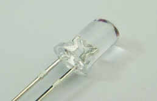

发光二极管，正向通电点亮，反向通电不亮
#### 面包板（Breadboard）
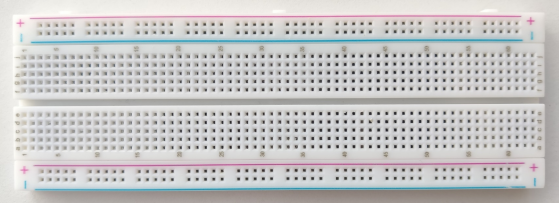

面包板是一种用于电子电路快速搭建与实验验证的工具，其特点是在无需焊接的情况下完成电子元件之间的连接，因此广泛应用于电子教学、嵌入式开发与原型设计等场景。

面包板内部已经预先连接好金属导电片，开发者只需将开发板、传感器、LED 与杜邦线插入对应孔位，即可快速完成电路连接。
##### 面包板中间实验区

在中间实验区中：

> 同一竖排中的 5 个插孔通常内部连通。

例如：

```text
●
●
●
●
●
```

这一排中的插孔可以直接导通，而不同竖排之间默认不连通。

##### 中央隔离槽

面包板中央通常存在一条隔离槽，用于将上下两部分分开。

因此：

> 上下两侧默认不连通。

若需要连接上下区域，需要使用杜邦线。

##### 两侧电源区

面包板两侧通常为电源轨：

```text
+ + + + + + +

- - - - - - -
```

其中：

|标识|作用|
|---|---|
|+|电源正极|
|-|GND 地线|

同一横排电源轨通常内部连通，可用于统一供电。

##### 本实验中的作用

在本实验中，面包板用于连接：

- Milk-V Duo S 开发板
- DHT22 温湿度传感器
- LED
- 杜邦线

从而完成温湿度采集与 LED 控制实验。
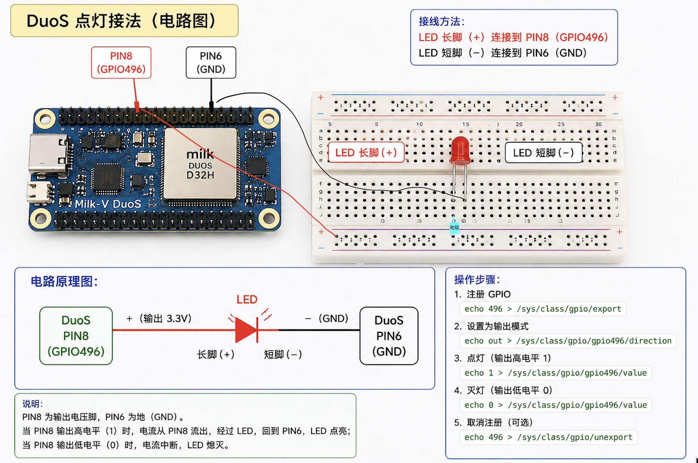


### 7.5.2 函数定义
#### 1. pinMode()

作用告诉开发板：

> “这个针脚是输入，还是输出”。

格式：

```
pinMode(引脚编号, 模式);
```

示例：

```
pinMode(LEDPIN, PINMODE_OUTPUT);
```

意思：

> “把 LED 引脚设置成输出模式。”

因为LED 是“被控制”的。

|模式|作用|
|---|---|
|PINMODE_OUTPUT|向外发送信号|
|PINMODE_INPUT|接收外部信号|

#### 2. digitalWrite()

作用：

控制引脚输出高低电平。

可以理解为：

| 代码   | 效果  |
| ---- | --- |
| HIGH | 打开  |
| LOW  | 关闭  |


示例：

```
digitalWrite(LEDPIN, HIGH);
```

意思：

> “让 LED 亮起来。”

#### 3. delay()

作用：等待一段时间。

单位：毫秒（ms）


示例：

```
delay(1000);
```

意思：

> “等待 1 秒。”

因为：

1000 毫秒 = 1 秒。

#### 4. printf()

作用：在终端显示文字。

可以理解成：

> “让程序说一句话。”

---

示例：

```c
printf("Hello");
```

运行后会显示：

```text
Hello
```


示例：

```c
printf("温度:%.1f°C → LED 灭\n", temp);
```

意思：

> “显示当前温度，并告诉用户 LED 已关闭。”


其中：

```c
%.1f
```

表示：

> 显示一个小数，并保留 1 位小数。

例如：

```text
27.3
31.5
```


```c
\n
```

表示：

> 换行。

否则下一次输出会挤在同一行。


如果：

```text
temp = 27.3
```

程序会输出：

```text
温度:27.3°C → LED 灭
```


### 7.5.2 本实验会用到的 Linux 命令

#### 1. cd

作用：进入文件夹。

可以理解成：

> “切换到另一个目录。”


示例：

```
cd dht22
```

意思：

> “进入 dht22 文件夹。”


#### 2. ls

作用：查看当前文件夹里的文件。

可以理解成：

> “看看里面有什么东西。”


示例：

```
ls
```

运行后会显示：

```
dht22.cMakefileREADME.md
```


#### 3. nano

作用：编辑文件。

可以理解成：

> “打开代码进行修改。”


示例：

```
nano dht22.c
```

意思：

> “打开 dht22.c 文件进行编辑。”

#### 4.riscv64-plct-linux-gnu-gcc

作用：编译 RISC-V 开发板程序。

可以理解成：

> “把 C 语言代码编译成 RISC-V 开发板能运行的程序。”


示例：

```bash
cd dht22

riscv64-plct-linux-gnu-gcc dht.c -o dht22 \
-I../include/system \
-L../libs/system/musl_riscv64 \
-lwiringx
```

意思：

> “把 dht.c 编译成开发板可以运行的 dht22 程序。”

其中：

|参数|作用|
|---|---|
|dht.c|要编译的代码文件|
|-o dht22|生成的程序名字|
|-I|添加头文件路径|
|-L|添加库文件路径|
|-lwiringx|链接 wiringX 库|


编译成功后，会生成：

```text
dht22
```

这个文件就可以上传到 RISC-V 开发板运行。

### 初始化 LED

```
int main() {
    // 初始化 WiringX
    if(wiringXSetup("milkv_duos", NULL) == -1) {
        printf("WiringX 初始化失败\n");
        return -1;
    }
    
    // 初始化 LED 引脚
    pinMode(LEDPIN, ______);        // 填空1：设置引脚模式
    digitalWrite(LEDPIN, ______);   // 填空2：设置初始状态
    
    // 其他代码...
}

```

#### 题目 1：设置引脚模式，让 LED 可以工作

让开发板知道：

> “LED 是输出设备”。

##### 代码

```
pinMode(LEDPIN, ________);
```

##### 选项

```
PINMODE_OUTPUT
PINMODE_INPUT
```

####  题目 2：让 LED 初始保持熄灭状态

##### 代码

```
digitalWrite(LEDPIN, ______);
```

##### 选项

```
HIGH
LOW
```

### 发送起始信号

```
// 1. 发送起始信号
pinMode(DHTPIN, ______);           // 填空3：设为输出模式
digitalWrite(DHTPIN, ______);      // 填空4：拉高电平
delay(500);
digitalWrite(DHTPIN, LOW);      // 拉低电平
delay(20);
pinMode(DHTPIN, PINMODE_INPUT);           // 设为输入模式

```
#### 题目3：设置传感器模式为输出模式
##### 代码

```
pinMode(DHTPIN, ______);
```

##### 选项

```
PINMODE_INPUT
PINMODE_OUTPUT
```


#### 题目 4：发送开始信号

先让引脚保持高电平

##### 代码

```
digitalWrite(LEDPIN, ______);
```

##### 选项

```
HIGH
LOW
```


### 判断温度控制LED

```
if(read_dht22(&temp, &humi)) {
    // 控制 LED
    if(______) {                    // 填空5：温度大于30度的条件
        digitalWrite(LEDPIN, HIGH);  // 点亮LED
        printf("温度:%.1f°C → LED 亮\n", temp);
    } else {
        digitalWrite(LEDPIN, LOW);  // 熄灭LED
        printf("温度:%.1f°C → LED 灭\n", temp);
    }
}
```

#### 温度判断小游戏！如果温度太高，就亮灯

```
if(temp > ______)
```

#### 选项

```
10
30
1000
```

### 等待间隔
#### 题目6：让程序等待 2 秒
##### 代码

```
// DHT22 采样周期至少2秒
______(______);           // 填空6：等待2秒的函数

```

##### 选项
```
delay 2000
if 200
```

### 预测题

如果这样会发生什么？

```
传感器检测到现在的温度，例如现在是25度
```

#### 选项

```
温度:25.0°C → LED 亮

温度:25.0°C → LED 灭
```

### 自由实验

把：

```
temp > 30
```

改成：

```
temp > 目前的温度
```

看看灯什么时候亮。

### 7.5.3 完整代码

```
/*
 * dht22_led_demo_simple.c
 * 简化版：读取 DHT22 温湿度，温度 > 30°C 时点亮 LED
 * 用法：gcc -o dht22_led_demo dht22_led_demo_simple.c -lwiringx
 */

#include <stdio.h>
#include <stdlib.h>
#include <unistd.h>
#include <time.h>
#include <wiringx.h>

// 引脚定义
#define DHTPIN 23   // DHT22 数据引脚
#define LEDPIN 21   // LED 控制引脚

// DHT22 读取函数
int read_dht22(float *temperature, float *humidity) {
    uint8_t data[5] = {0, 0, 0, 0, 0};
    
    // 1. 发送起始信号
    pinMode(DHTPIN, PINMODE_OUTPUT);
    digitalWrite(DHTPIN, HIGH);
    delay(500);              // 改用 delay，更稳定
    digitalWrite(DHTPIN, LOW);
    delay(20);               // 20ms 起始信号
    pinMode(DHTPIN, PINMODE_INPUT);
    
    // 2. 等待响应（简单超时）
    int timeout = 0;
    while(digitalRead(DHTPIN) == HIGH && timeout < 1000) {
        delayMicroseconds(1);
        timeout++;
    }
    if(timeout >= 1000) return 0;
    
    while(digitalRead(DHTPIN) == LOW && timeout < 1000) {
        delayMicroseconds(1);
        timeout++;
    }
    if(timeout >= 1000) return 0;
    
    while(digitalRead(DHTPIN) == HIGH && timeout < 1000) {
        delayMicroseconds(1);
        timeout++;
    }
    if(timeout >= 1000) return 0;
    
    // 3. 读取40位数据
    for(int i = 0; i < 40; i++) {
        while(digitalRead(DHTPIN) == LOW);
        
        int duration = 0;
        while(digitalRead(DHTPIN) == HIGH && duration < 100) {
            delayMicroseconds(1);
            duration++;
        }
        
        // 根据高电平持续时间判断0或1
        if(duration > 30) {
            data[i/8] |= (1 << (7 - (i % 8)));
        }
    }
    
    // 4. 校验数据
    if(data[4] == ((data[0] + data[1] + data[2] + data[3]) & 0xFF)) {
        *humidity = (data[0] * 256 + data[1]) / 10.0;
        *temperature = ((data[2] & 0x7F) * 256 + data[3]) / 10.0;
        if(data[2] & 0x80) *temperature *= -1;
        return 1;
    }
    
    return 0;
}

int main() {
    // 初始化 WiringX
    if(wiringXSetup("milkv_duo", NULL) == -1) {
        printf("WiringX 初始化失败\n");
        return -1;
    }
    
    // 初始化 LED 引脚
    pinMode(LEDPIN, PINMODE_OUTPUT);
    digitalWrite(LEDPIN, LOW);
    
    printf("\n========================================\n");
    printf("  DHT22 温湿度传感器 + LED 控制\n");
    printf("  温度 > 30°C 时 LED 点亮\n");
    printf("  按 Ctrl+C 退出\n");
    printf("========================================\n\n");
    
    float temp, humi;
    int read_count = 0;
    int fail_count = 0;
    
    while(1) {
        if(read_dht22(&temp, &humi)) {
            // 读取成功
            read_count++;
            fail_count = 0;
            
            time_t now = time(NULL);
            struct tm *tm_info = localtime(&now);
            
            // 控制 LED
            if(temp > 30.0) {
                digitalWrite(LEDPIN, HIGH);
                printf("[%02d:%02d:%02d] ✓ 温度:%.1f°C 湿度:%.1f%% → LED 亮\n",
                       tm_info->tm_hour, tm_info->tm_min, tm_info->tm_sec, temp, humi);
            } else {
                digitalWrite(LEDPIN, LOW);
                printf("[%02d:%02d:%02d] ✓ 温度:%.1f°C 湿度:%.1f%% → LED 灭\n",
                       tm_info->tm_hour, tm_info->tm_min, tm_info->tm_sec, temp, humi);
            }
        } else {
            // 读取失败
            fail_count++;
            printf("读取失败 (%d/5)，检查 DHT22 接线\n", fail_count);
            
            // 连续失败5次，可能是硬件问题
            if(fail_count >= 5) {
                printf("连续读取失败，请检查：\n");
                printf("1. DHT22 是否正确连接到 GPIO %d\n", DHTPIN);
                printf("2. 是否需要上拉电阻（4.7kΩ 到 3.3V）\n");
                printf("3. 传感器是否损坏\n");
                fail_count = 0; // 重置计数，继续尝试
            }
        }
        
        // 等待2秒（DHT22 采样周期至少2秒）
        delay(2000);
    }
    
    return 0;
}
```

# 8.参考资料

本教程仅作为交流学习使用

- https://www.bilibili.com/video/BV1KM4m1U7f1/
- https://www.bilibili.com/video/BV1BV41197rY/
- https://www.bilibili.com/video/BV1th411z7sn