# K230 AI例程演示说明
## 准备

- CanMV-K230 主板 x 1
- OV5647 摄像头 x 1
- Type-C 数据线 x 2
- 电源适配器 x 1
- TF卡 x 1
- 读卡器 x 1
- HDMI线 x 1
- 显示屏 x 1
- 电脑 x 1
## 连接方法

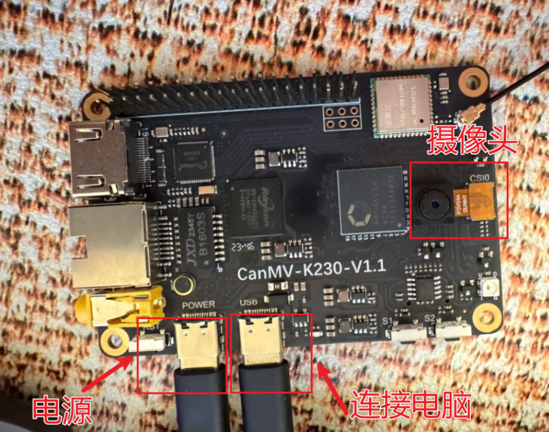
## 烧录方法

1. 镜像地址：[Releases · kendryte/k230_canmv (github.com)](https://github.com/kendryte/k230_canmv/releases)
*请下载“CanMV-K230_micropython”开头的gz压缩包，解压得到sysimage-sdcard.img文件，即为CanMV-K230的固件。
2. 使用读卡器将sd卡插入电脑
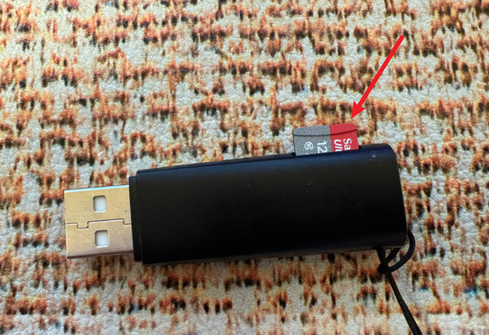
3. 使用烧录软件
烧录软件下载：[balenaEtcher - Flash OS images to SD cards & USB drives](https://etcher.balena.io/)
选择img镜像文件，选择sd卡，点击烧录，如验证失败可以忽略
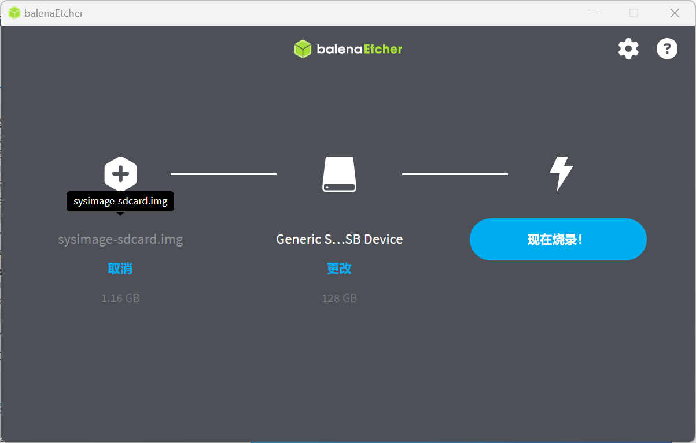
## 查看k230
把烧录好的sd卡插入k230背面的sd卡槽，连接电源，然后使用一根Type-C数据线将k230与电脑连接，确认识别k230，确保成功启动

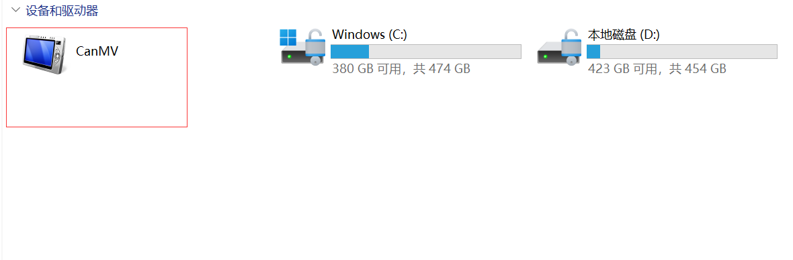
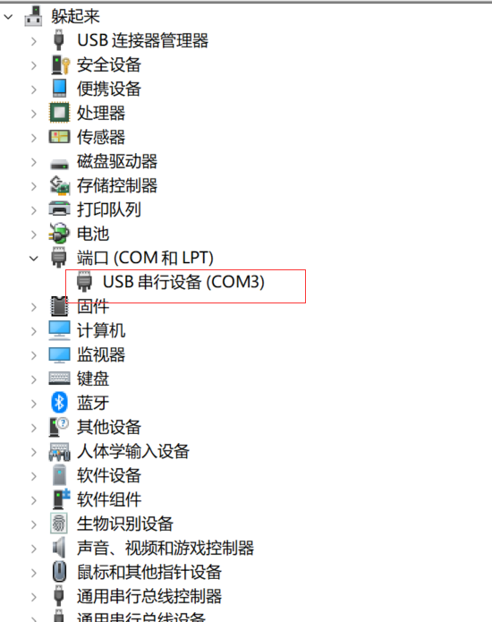

## 连接IDE

下载地址：[Releases · kendryte/canmv_ide (github.com)](https://github.com/kendryte/canmv_ide/releases)
正常安装
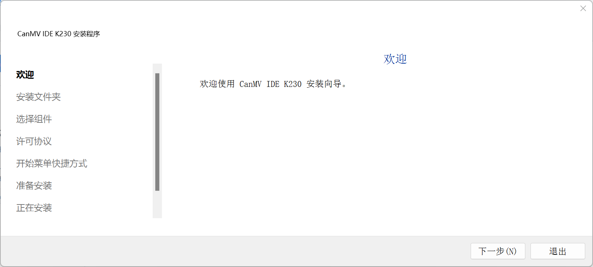

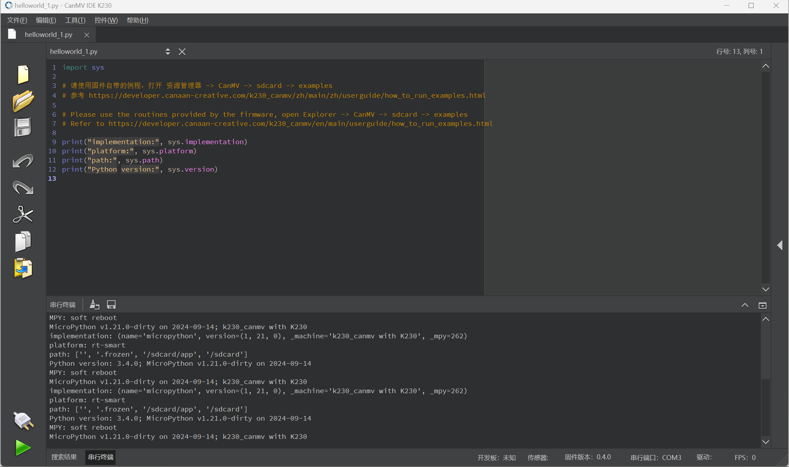
## 运行Demo

1. 打开虚拟U盘，找到动态手势demo（ 路径：此电脑\CanMV\sdcard\app\tests\ai_demo）
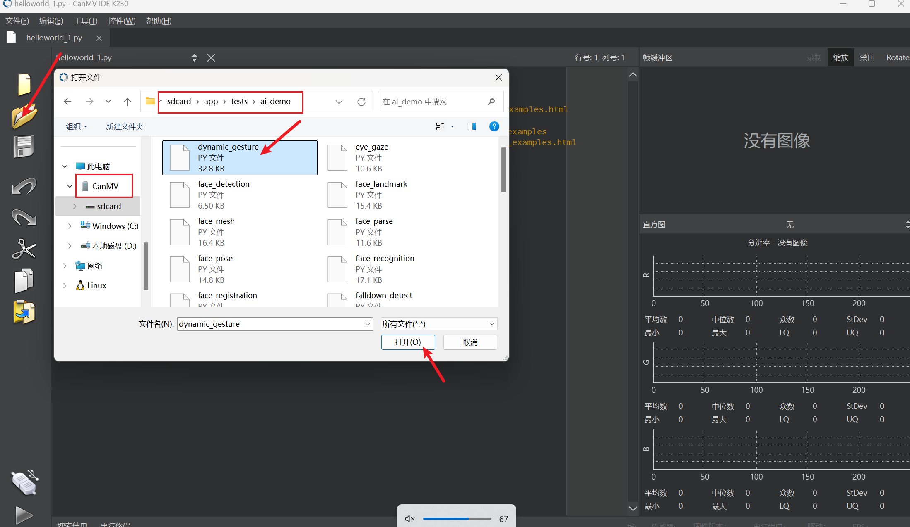
2. 连接k230
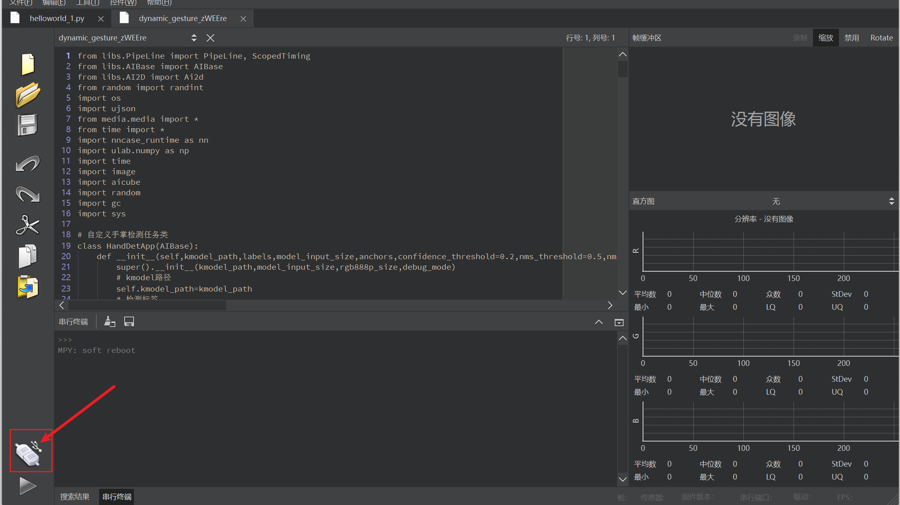
3. 点击运行
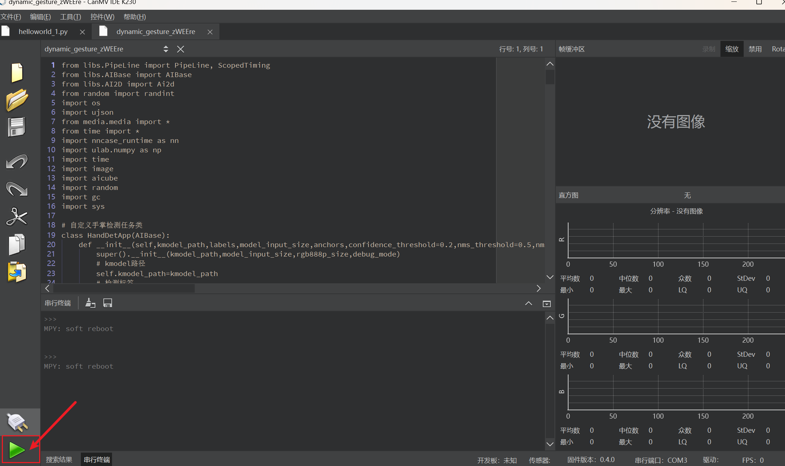
4. 运行结果
可以显示手的上下左右方向
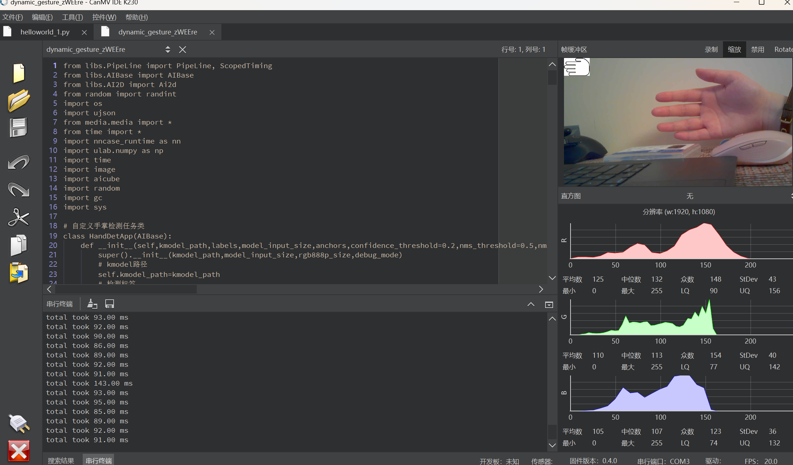
## Demo列表：
动态手势识别：\CanMV\sdcard\app\tests\ai_demo\dynamic_gesture
说明：可以显示手的上下左右方向
人脸检测:\CanMV\sdcard\app\tests\ai_demo\face_detection
说明：框选出拍摄到的人脸
人脸关键部位:\CanMV\sdcard\app\tests\ai_demo\face_landmark
说明：检测拍摄到的眼睛、鼻子、嘴巴
猜拳游戏:\CanMV\sdcard\app\tests\ai_demo\finger_guessing
说明：手进入画面时，和ai进行第1局猜拳，手离开画面后再次进入画面进入第2局，共3局，最后显示胜负，有检测错误的可能。

