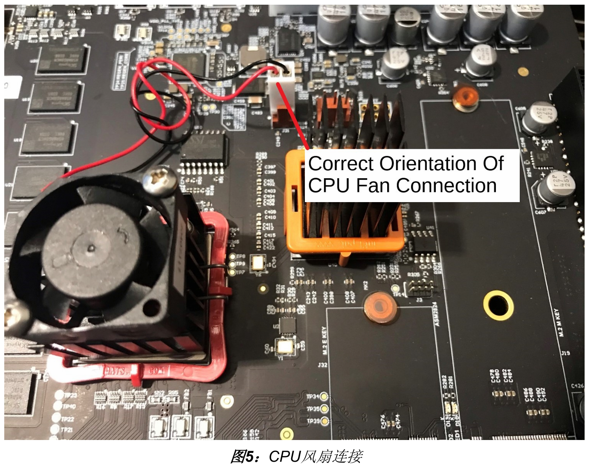
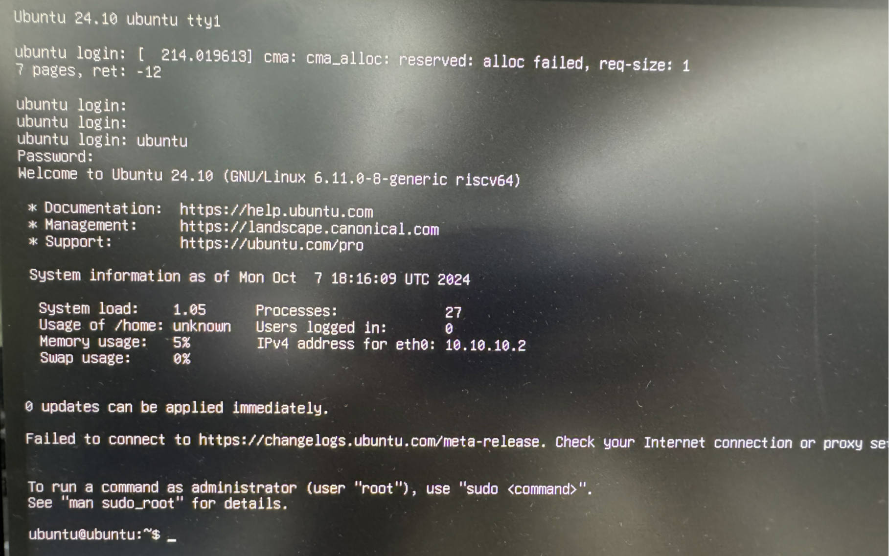

# 在Unmatched运行Ubuntu-24.10

## 1 烧写镜像

- 镜像地址：[Download Ubuntu for RISC-V Platforms | Ubuntu](https://ubuntu.com/download/risc-v)
- 烧录工具：[balenaEtcher - Flash OS images to SD cards & USB drives](https://etcher.balena.io/)
- 参考文档：[HiFive Unmatched Getting Started Guide v1p4](https://sifive.cdn.prismic.io/sifive/b9376339-5d60-45c9-8280-58fd0557c2f0_hifive-unmatched-gsg-v1p4_ZH.pdf)

## 2 选择启动模式

## 3 CPU风扇连接

## 4 连接电源

按住并松开电源按钮，打开开发板的电源。开发板通电后，CPU风扇应工作，3个 绿色LED灯亮起。这表明开发板正常通电，所有需要的内部电源都已启动。 此外，机箱风扇也应该默认启动工作，不需要任何软件控制。

## 5 串口登录

**使用USB到串口模拟器显示到主机的控制台输出，串口配置选项如下：**
- 速度（波特率）：115200 
- 数据位：8 
- 停止位：0 
- 奇偶校验：无 
- 流量控制：无

FTDI 2232H串行/JTAG转USB控制器用于与主机通信。当micro-USB线插入主机时，在大多数情 况下，主机操作系统（OS）会检测到FTDI设备，并自动安装适当的设备驱动程序，以便与该设 备进行通信。然而，可能在某些情况下，这不会自动进行，需要手动安装这些驱动程序。如要手 动安装，请查看FTDI支持网站上的设备驱动程序和操作系统特定安装说明。 

- 安装指南：https://ftdichip.com/document/installation-guides/
```
默认用户名：`ubuntu` 
默认密码：`ubuntu`
初次登录需要修改密码
```

## 6 运行结果

