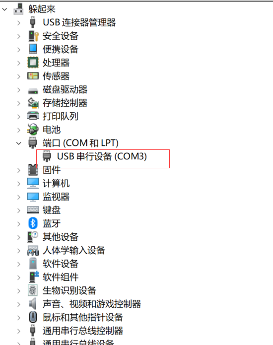
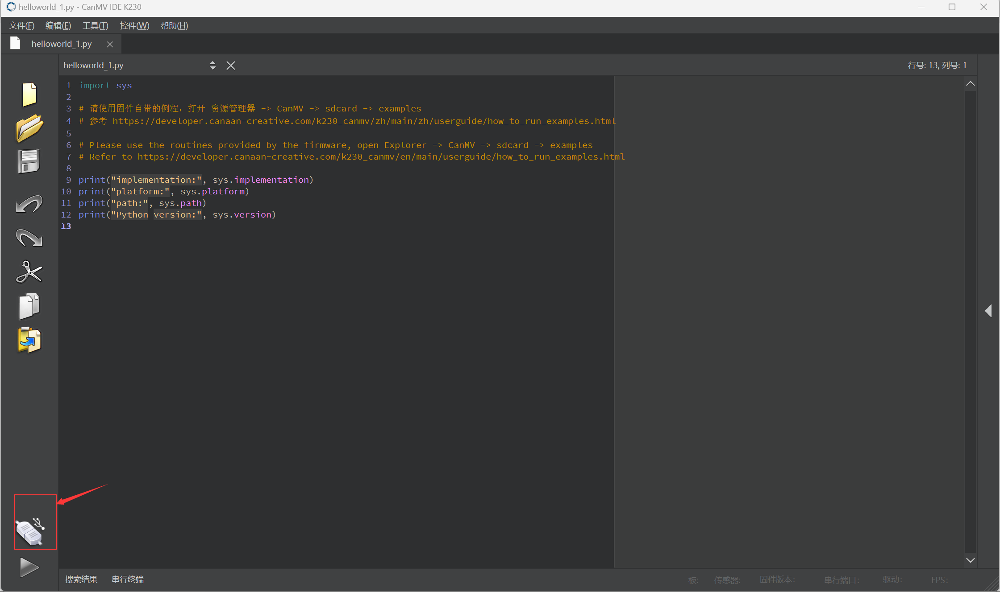

# k230 启动

## 1.烧录固件
下载地址：[Releases · kendryte/k230_canmv (github.com)](https://github.com/kendryte/k230_canmv/releases)

## 2.查看k230
使用一根Type-C数据线将k230与电脑连接，确认识别k230，确保成功启动

## 3.连接IDE

下载地址：[Releases · kendryte/canmv_ide (github.com)](https://github.com/kendryte/canmv_ide/releases)
正常安装

点击连接开发板

运行python代码

## 4.运行Demo

打开虚拟U盘

运行单目标跟踪demo
